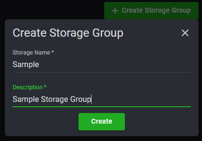
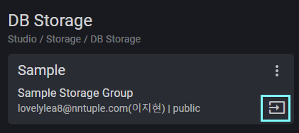
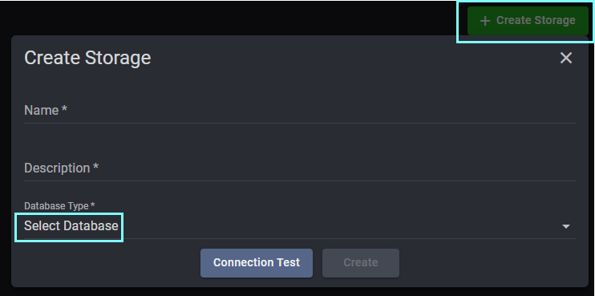
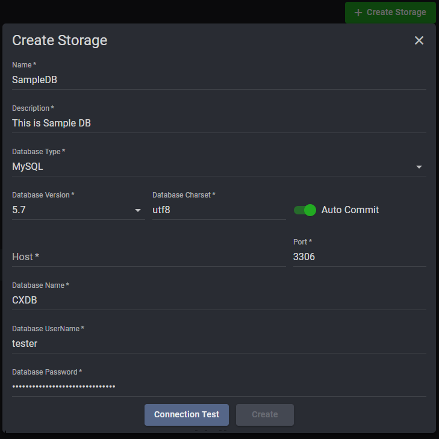

## Storage(DB Storage)

    Strorage > DB Storage > Create Storage Group

    : Storage Group으로 설정할 그룹명과 설명 입력

   

    Strorage Group > Create Storage > Database Type 선택 

    : Storage Connection 정보를 입력한 후 Connection Test를 하고 성공 시, Save하여 연동 완료

  

    Apps > 연결하려는 APP의 Function > 등록된 Storage 중 원하는 것을 선택하여 연결

  