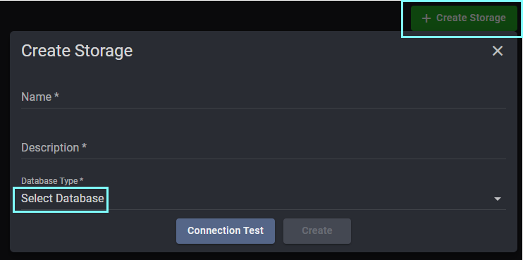

## Storage > DB Storage

Here's how to connect to a database.

    Strorage > DB Storage > Create Storage Group

    : Enter the group name and description to set as Storage Group

   

    Strorage Group > Create Storage > Select Database Type

    : After entering storage connection information, conduct a connection test and, if successful, save to complete the connection

  

    Apps > Function of the APP you want to connect > Select and connect from registered storage

  