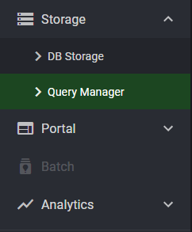
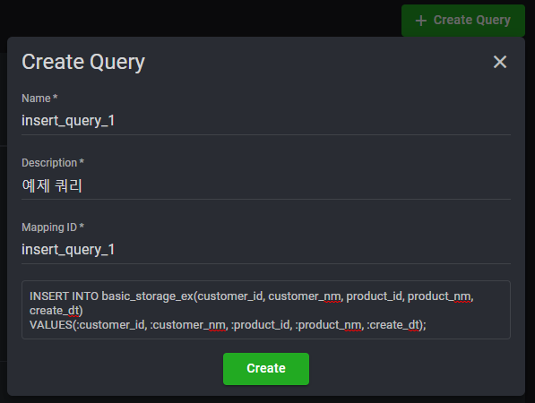
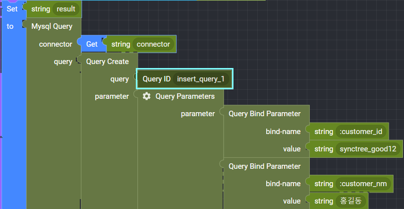

## Storage > Query Manager

How to register and map Query is introduced.

    Strorage > Query Manager > Create Query

    : Enter the query name and description, the *Mapping ID (important)* to be mapped to the storage block, and the query statement

 

