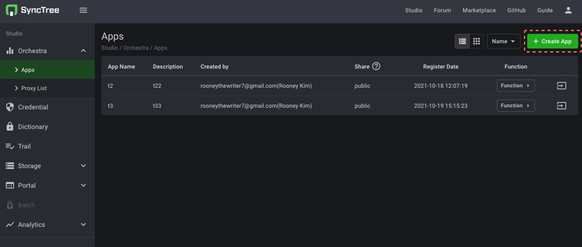
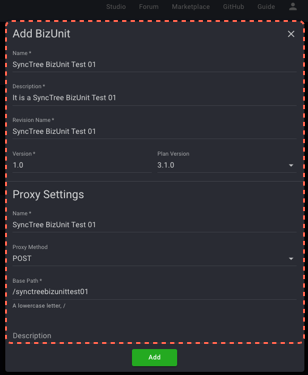

#### STEP 2-3

1. Click the 'Create App' button to create the app.
2. Fill in the application information and click the 'Create' button.
3. Click the 'Arrow' button created on the top of the right side.

    1
    
    2
    
    3
    

#### STEP 2-4

1. Click the 'Add BizUnit' button to create a biz unit.
2. Fill in the application form for 'Add BizUnit' and "Proxy Setting'.

    1
    
    2
    

#### STEP 2-5

1. Click the arrow button on the top of the right in the App.
2. Click the arrow button on the bottom of the right of the 'Revision:Dev' box.

    1
    
    2
    

