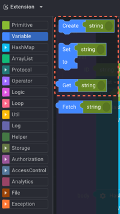
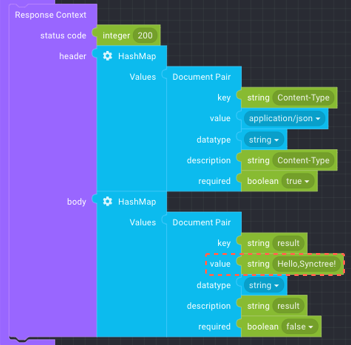

## API Editing

#### STEP 2-6

##### 1. Block coding

Select the 'Variable' from the block type on the left. Select the two blocks for 'Create', 'Set/to' and put them into the 'Statements' and bring the 'string' from 'Primitive' and put into 'to' of 'Set/to'. And select the two same blocks for 'Create', 'Set/to' again, and put them under the 'Create' block and 'Set, to' block. Bring the 'Get/string' from 'Variable' and put the 'Get/string' block to the right side of the second 'Set/to' block.

##### 2. Insert Variable value

Type in 'input' to each variable value of the string from the 'Create' block and 'Set' block and type in 'I love SyncTree!' to the string of 'to' block. Type in 'result' to the string of the 'Create' and 'Set' block below, type in 'input' to the string of the 'to/Get' block.

    1
    
    2
    
    3
    

#### STEP 2-7

1. Remove the 'string' attached to the value from the second 'Document Pair' of 'Response Context' below.
2. in 'Variable', bring the 'Get string' and attach it. And type in 'result' on the string.

    1
    
    2
    

