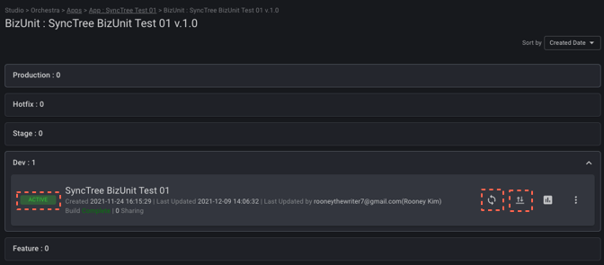
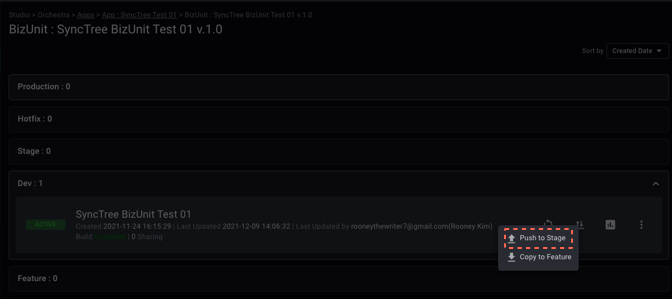
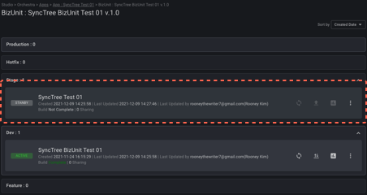
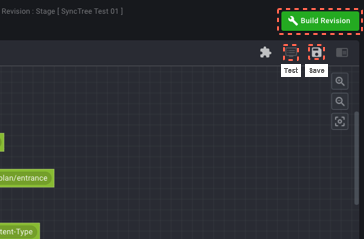
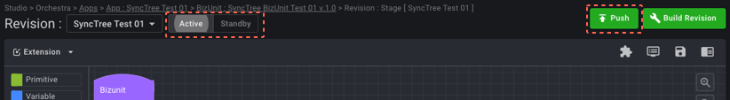
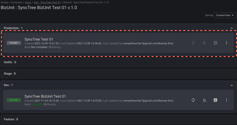
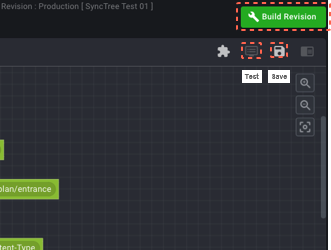
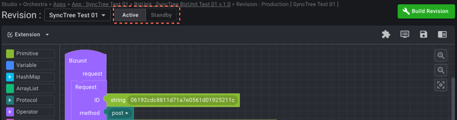

## Push API (Revision per step)

#### STEP 2-9

1. Back to your BizUnit(Orchestra > Apps) again and Click 'Change Revision Status' to change your status to 'ACTIVE'.
2. Fill in the 'Revision Name' and 'Comment' after clicking 'Push to Stage' button on the 'Push/Copy Revision'.

    1
    
    2
    

#### STEP 2-10

1. Click the new box created on the Stage.
2. Click SAVE > Build Revision >Test button, and click the 'Run' button in the new window. And click the 'ACTIVE' box on the top of the left and click the 'Push' button on the top of the right.

    1
    
    2
    
    3
    

#### STEP 2-11

1. Click the 'Production box'.
2. Click SAVE > Build Revision > Test button, and click the 'Run' button in the new window.
3. Click the 'ACTIVE' box on the top of the left.

    1
    
    2
    
    3
    

