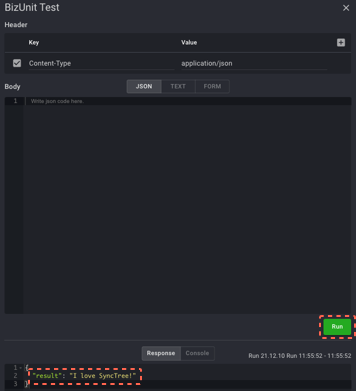

## API Testing

#### STEP 2-8

1. Click the 'Save' button on the top of the right. And click the 'Build Revision' and click the 'Test' button on the left of the 'Save' button.
2. Click the 'Run' button once the new window is opened and 'I love SyncTree!' has been successfully installed.

    1
    2
    
    

