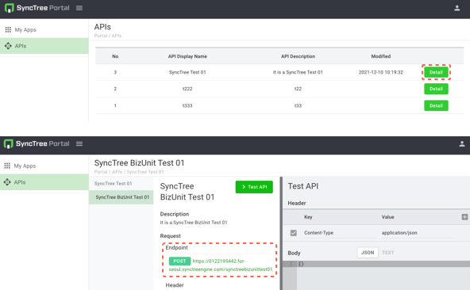

## Register Portal and API Confirmation

#### STEP 2-14

1. Sign up to create your account on 'My Portal'.
2. Log in to 'My Portal' and move to APIs to check 'API Display Name' and click the 'Detail' button. Now You can find the 'API URL' You created on the 'End Point'

    1
    2
    
    
 

