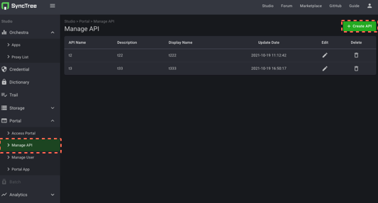
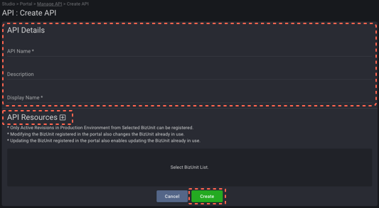
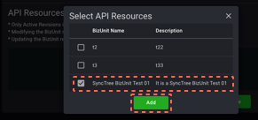

## Portal Creation and API Registration

#### STEP 12

1. Click the 'Create API' button on Manage API.
2. Click the 'Create' button after fill in the 'API Details'.
3. Choose the 'BizUnit' you created after click the 'API Resources' button on the bottom.

    1
    
    2
    
    3
    <em class='abs arrow' style='bottom: 87px;left: 87px;'>➡</em>
    

#### STEP 13

1. Move to Access Portal and click 'Portal link' to move to Portal.

