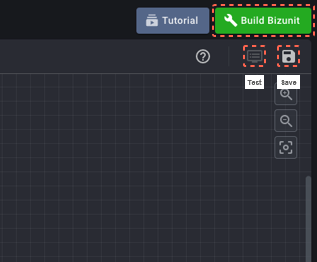
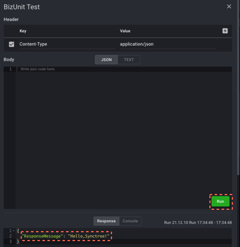

#### STEP 1-3

1. Save with the 'Save' button on the top of the right and build with the 'Build Bizunit' button. And click the 'Test' button once it's activated on the left side of the 'Save' button. Click the 'Run' button once the new window is opened.

2. 'Hello, SyncTree!' has been activated now. if you want to develop a full-scale API, join our SyncTree studio through the next steps.

    1
    
    2
    

