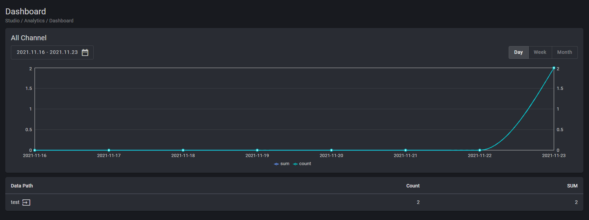
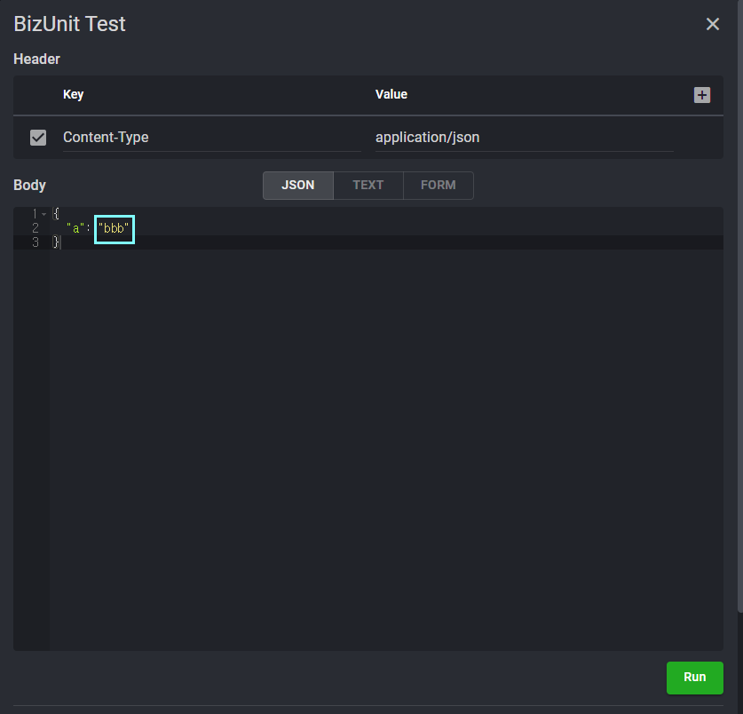

## Analytics

### ● Analytics Event

    Collect data about interactions when events occur

#### ● Example

    1. Studio > Analytics > Custom Metrics > Create Metrics

    2. Check the generated Metrics ID value

Studio Copy&Paste Available

<iframe
    src="https://d1sxhpvag16wqc.cloudfront.net/v3.1.0/analytics/analytics"
    width="100%"
    height="800px"
    allow=""
    sandbox="allow-scripts allow-same-origin" />

    

    

    3. Type "aaa" to count Trigger Metrics > test Channel > visit Menu > "call" Action +1

    Metrics > "Channel" Level

    Metrics > Channel > "Menu" Level

    Metrics > Channel > Menu > Action Level > "call"

    Metrics > Channel > Menu > Action Level > "visit"

    4. Type "bbb" to count Trigger Metrics > test Channel > visit Menu > "call" Action -1

    Metrics > "Channel" Level

    Metrics > Channel > "Menu" Level

    Metrics > Channel > Menu > Action Level > "call"

    Metrics > Channel > Menu > Action Level > "visit"

