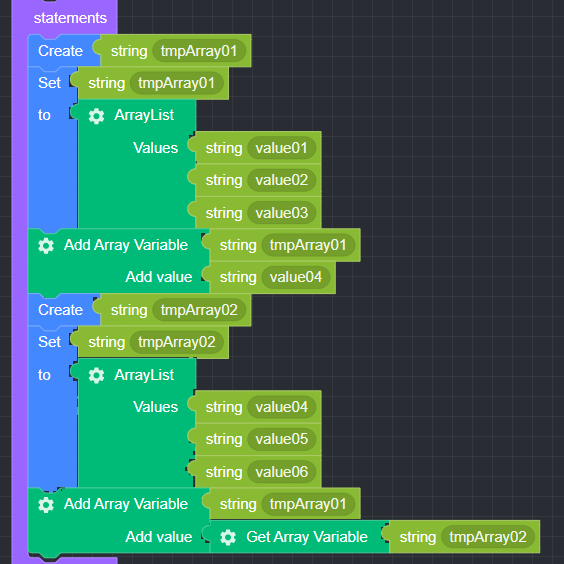
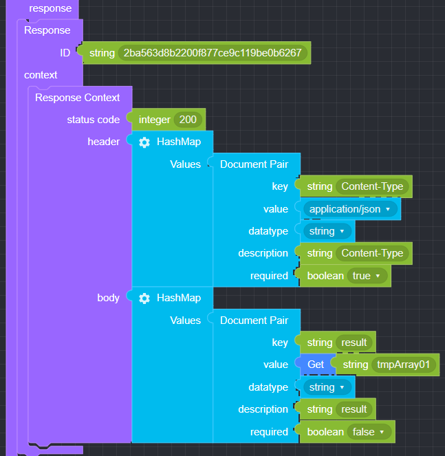

## Add Array Variable

### ● **Add Array Variable**

        Add a value to an array variable


        You can add or delete items by clicking the settings button


### ● \***\*Add Array Variable **Example\*\*

<p class='comment'>Studio Copy&Paste Available</p>
<iframe
    src="https://d1sxhpvag16wqc.cloudfront.net/v3.1.0/arrayList/add_arraylist"
    width="100%"
    height="800px"
    allow=""
    sandbox="allow-scripts allow-same-origin" />
<div class="display-pdf">
    <p></p>
    <p></p>
</div>

### ● \***\*Add Array Variable **Result\*\*

```text
{
  "result": [
    "value01",
    "value02",
    "value03",
    "value04",
    [
      "value04",
      "value05",
      "value06"
    ]
  ]
}
```
