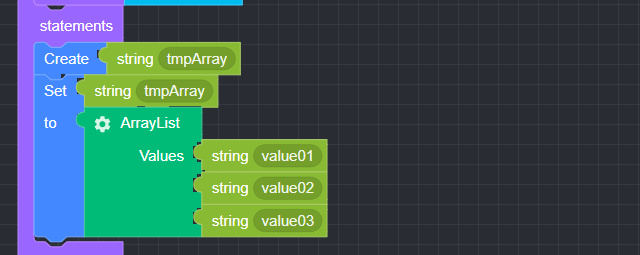

## ArrayList

### ● ArrayList

        Array Values


        You can add or delete items by clicking the settings button


### ● \***\*ArrayList **Example\*\*

<p class='comment'>Studio Copy&Paste Available</p>
<iframe
    src="https://d1sxhpvag16wqc.cloudfront.net/v3.1.0/arrayList/arrayList"
    width="100%"
    height="800px"
    allow=""
    sandbox="allow-scripts allow-same-origin" />
<div class="display-pdf">
    <p></p>
    <p></p>
</div>

### ● \***\*ArrayList **Result\*\*

```text
{
  "result": [
    "value01",
    "value02",
    "value03"
  ]
}
```
