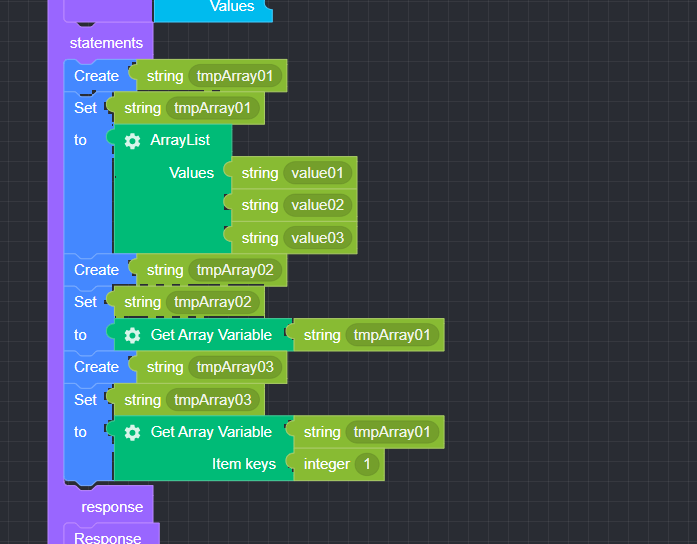
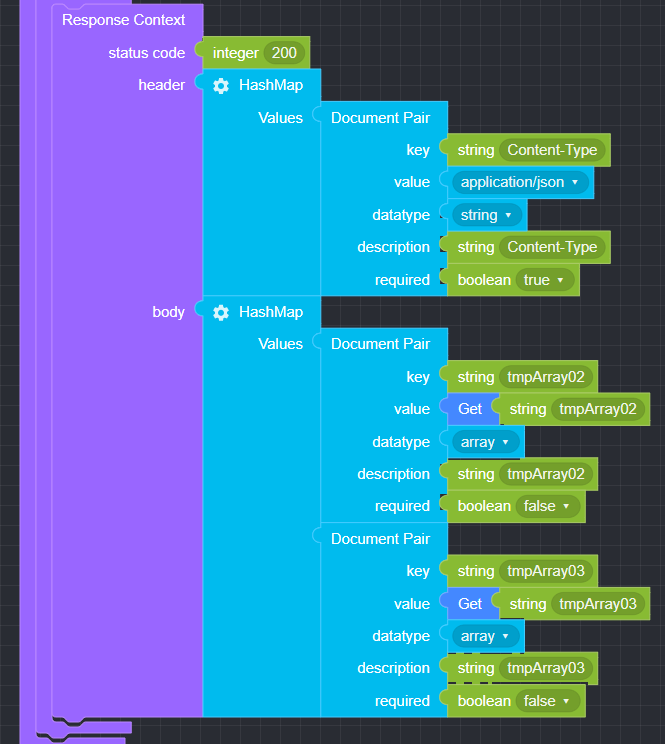

## Get Array Variable

### ● Get Array Variable

        Get the value of an array type variable or a specific key value of an array


        You can add or delete items by clicking the settings button


### ● Get Array Variable Example

<p class='comment'>Studio Copy&Paste Available</p>
<iframe
    src="https://d1sxhpvag16wqc.cloudfront.net/v3.1.0/arrayList/get_arraylist"
    width="100%"
    height="800px"
    allow=""
    sandbox="allow-scripts allow-same-origin" />
<div class="display-pdf">
    <p></p>
    <p></p>
</div>

### ● Get Array Variable Result

```text
{
  "tmpArray02": [
    "value01",
    "value02",
    "value03"
  ],
  "tmpArray03": "value02"
}
```
