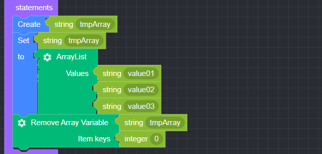

## Remove Array Variable

### ● **Remove Array Variable**

        Delete an array type variable value or a specific key value of an array


        You can add or delete items by clicking the settings button


### ● \***\*Remove Array Variable **Example\*\*
<p class='comment'>Studio Copy&Paste Available</p>
<iframe
    src="https://d1sxhpvag16wqc.cloudfront.net/v3.1.0/arrayList/remove_arraylist"
    width="100%"
    height="800px"
    allow=""
    sandbox="allow-scripts allow-same-origin" />
<div class="display-pdf">
    <p></p>
    <p></p>
</div>

### ● \***\*Remove Array Variable **Result\*\*

```text
{
  "result": [
    "value02",
    "value03"
  ]
}
```
