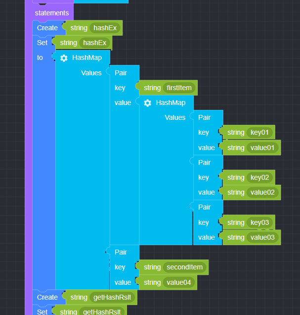

## Get HashMap Variable

### ● Get HashMap Variable

        Get the value of the entire HashMap or a specific value by matching key


        You can add or delete items by clicking the settings button


### ● \***\*Get HashMap **Example\*\*

<p class='comment'>Studio Copy&Paste Available</p>
<iframe
    src="https://d1sxhpvag16wqc.cloudfront.net/v3.1.0/hashmap/get_hashmap"
    width="100%"
    height="800px"
    allow=""
    sandbox="allow-scripts allow-same-origin" />
<div class="display-pdf">
    <p></p>
    <p></p>
</div>

### ● \***\*Get HashMap **Result\*\*

```text
{
  "result": {
    "getAll": {
      "firstItem": {
        "key01": "value01",
        "key02": "value02",
        "key03": "value03"
      },
      "secondItem": "value04"
    },
    "getByKey": "value02",
    "getByKey2": "value04"
  }
}
```
