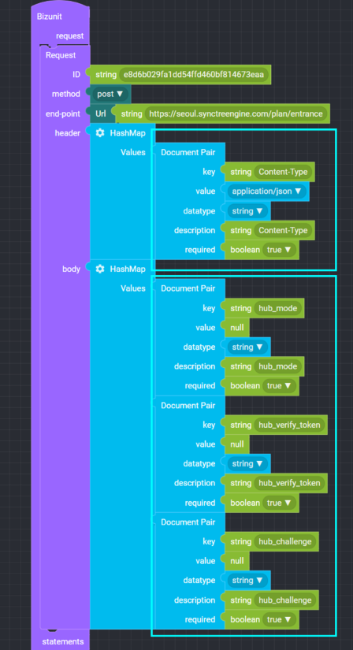
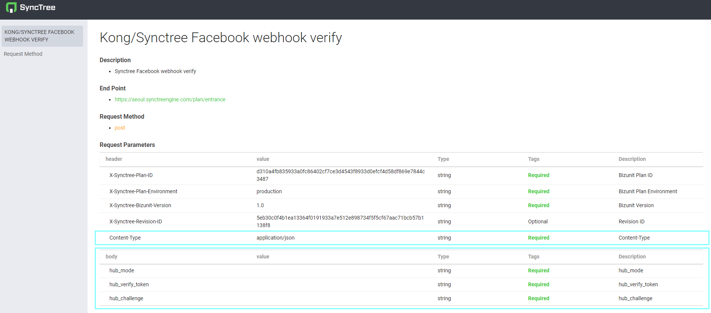

## Pair

### ● Pair

        Used for key & value mapping to HashMap

### ● Document Pair

         Pair to create API Document

##### ● 예시

### ● datatype

        Used when specifying the parameter type in Document Pair

