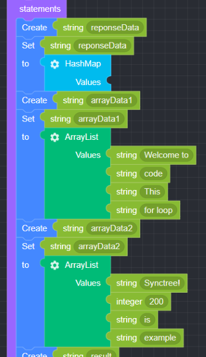
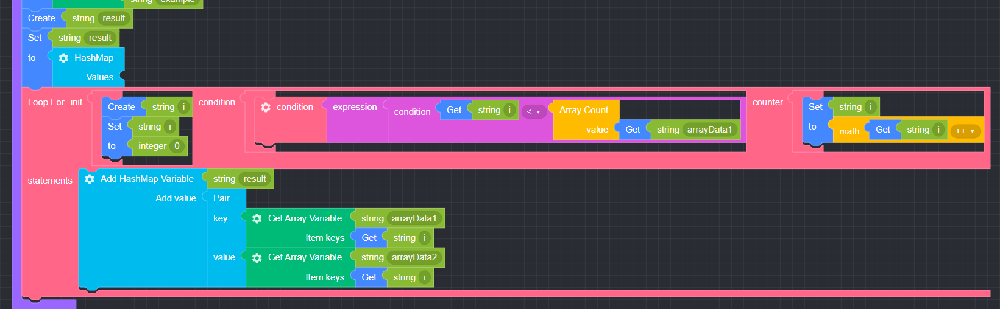
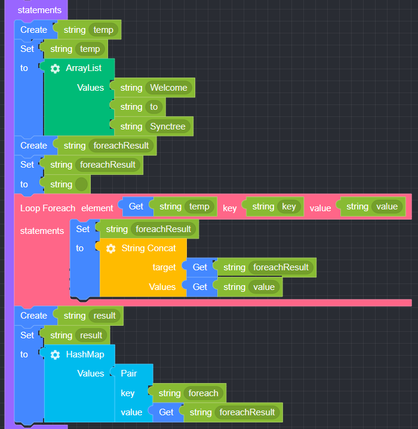
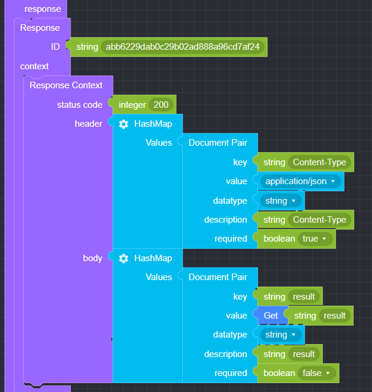

## Loop

### ● For

       A loop that repeats operations until a conditional expression is true


#### ● \***\***Example\*\*

<p class='comment'>Studio Copy&Paste Available</p>
<iframe
    src="https://d1sxhpvag16wqc.cloudfront.net/v3.1.0/loop/for_loop"
    width="100%"
    height="800px"
    allow=""
    sandbox="allow-scripts allow-same-origin" />
<div class="display-pdf">
    <p></p>
    <p></p>
</div>

#### ● \***\***Result\*\*

```text
{
  "result": {
    "Welcome to": "Synctree!",
    "code": 200,
    "This": "is",
    "for loop": "example"
  }
}
```

### ● Foreach

       Used to repeat the number of elements in an array or the number of properties in an object.


#### ● \***\***예제\*\*

<p class='comment'>Studio Copy&Paste Available</p>
<iframe
    src="https://d1sxhpvag16wqc.cloudfront.net/v3.1.0/loop/foreach_loop"
    width="100%"
    height="800px"
    allow=""
    sandbox="allow-scripts allow-same-origin" />
<div class="display-pdf">
    <p></p>
    <p></p>
</div>

#### ● \***\***Result\*\*

```text
{
  "result": {
    "foreach": "Welcome to Synctree!"
  }
}
```

### ● Control

#### break

       Loop Control: Used when out of control flow


#### continue

       Loop Control: Maintains the flow of control, skips the current part, and proceeds to the next statement


