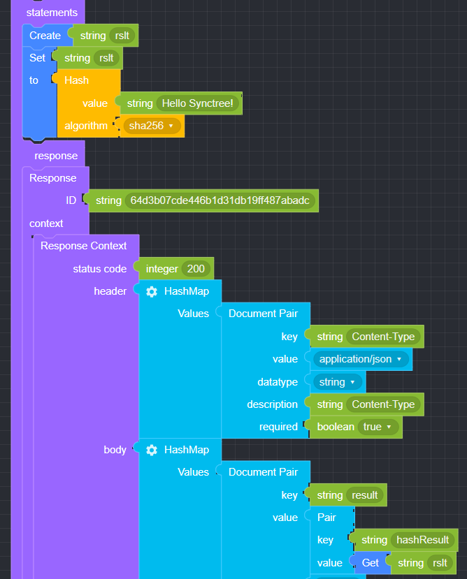
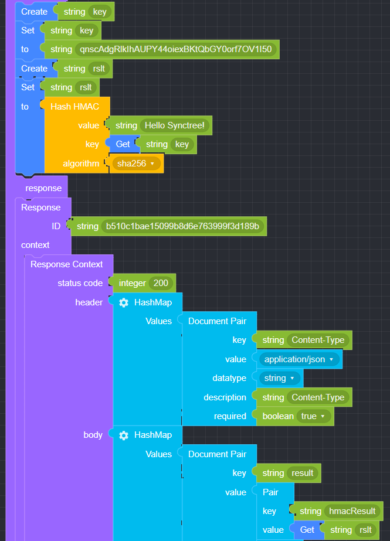

## Hash

### ● Hash

        Used to convert input data into XML format


#### ● Example

<p class='comment'>Studio Copy&Paste Available</p>
<iframe
    src="https://d1sxhpvag16wqc.cloudfront.net/v3.1.0/hash/hash"
    width="100%"
    height="800px"
    allow=""
    sandbox="allow-scripts allow-same-origin" />
<div class="display-pdf">
    <p></p>
</div>

#### ● Result

```text
{
  "result": {
    "hashResult": "6fb0522f54422c3b6bc31ca7e9c1d469f19e2a50d50c9e30a1eee2fd397f5761"
  }
}
```

### ● Hash HMAC

        Used to output the hash value with the algorithm entered after generating the HMAC value


#### ● Example

<p class='comment'>Studio Copy&Paste Available</p>
<iframe
    src="https://d1sxhpvag16wqc.cloudfront.net/v3.1.0/hash/hash_hmac"
    width="100%"
    height="800px"
    allow=""
    sandbox="allow-scripts allow-same-origin" />
<div class="display-pdf">
    <p></p>
</div>

#### ● Result

```text
{
  "result": {
    "hmacResult": "53626b23aacbc1891e56d5b83cd6977b0881679c3b0295c50aeca339c0d104cc"
  }
}
```

### ● available Algorithms

|               |                |                 |                |                |
| :------------ | :------------- | :-------------- | :------------- | :------------- |
| **md2**       | **ripemd256**  | **gost**        | **haval128,3** | **haval128,5** |
| **md4**       | **ripemd320**  | **gost-crypto** | **haval160,3** | **haval160,5** |
| **md5**       | **tiger128,3** | **adler32**     | **haval192,3** | **haval192,5** |
| **sha1**      | **tiger160,3** | **crc32**       | **haval224,3** | **haval224,5** |
| **sha224**    | **tiger192,3** | **crc32b**      | **haval256,3** | **haval256,5** |
| **sha256**    | **tiger128,4** | **fnv132**      | **haval128,4** |                |
| **sha384**    | **tiger160,4** | **fnv1a32**     | **haval160,4** |                |
| **sha512**    | **tiger192,4** | **fnv164**      | **haval192,4** |                |
| **ripemd128** | **snefru**     | **fnv1a64**     | **haval224,4** |                |
| **ripemd160** | **snefru256**  | **joaat**       | **haval256,4** |                |
