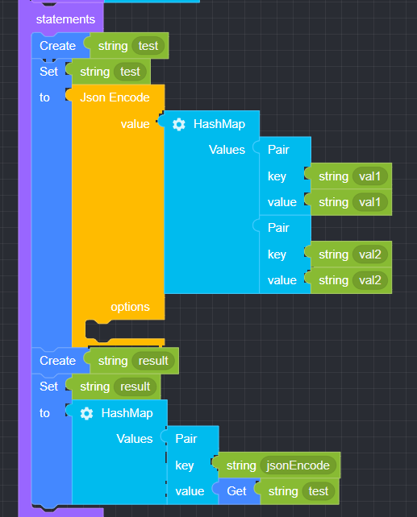
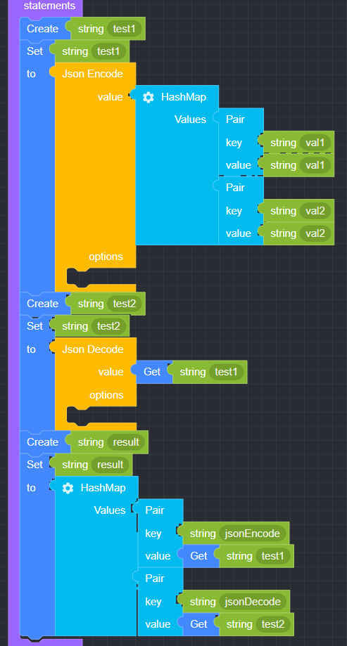

## Json

### ● Json Encode

        Used to convert input data into JSON format


#### ● Example

<p class='comment'>Studio Copy&Paste Available</p>
<iframe
    src="https://d1sxhpvag16wqc.cloudfront.net/v3.1.0/json/json_encode"
    width="100%"
    height="800px"
    allow=""
    sandbox="allow-scripts allow-same-origin" />
<div class="display-pdf">
    <p></p>
</div>

#### ● Result

```text
{
  "result": {
    "jsonEncode": "{\"val1\":\"val1\",\"val2\":\"val2\"}"
  }
}
```

### ● Json Decode

        Used to convert JSON-formatted data into decoded data.


#### ● Example

<p class='comment'>Studio Copy&Paste Available</p>
<iframe
    src="https://d1sxhpvag16wqc.cloudfront.net/v3.1.0/json/json_decode"
    width="100%"
    height="800px"
    allow=""
    sandbox="allow-scripts allow-same-origin" />
<div class="display-pdf">
    <p></p>
</div>

#### ● Result

```text
{
  "result": {
    "jsonEncode": "{\"val1\":\"val1\",\"val2\":\"val2\"}",
    "jsonDecode": {
      "val1": "val1",
      "val2": "val2"
    }
  }
}
```

### ● Encode Option

        Encoding options (based on PHP)


### ● Decode Option

        Decoding options (based on PHP)


