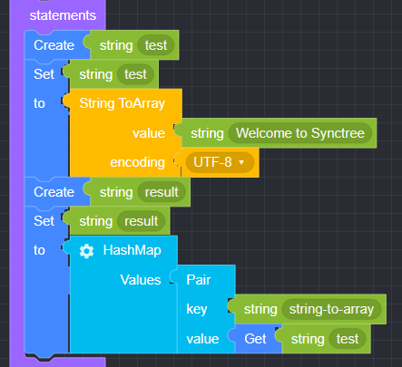
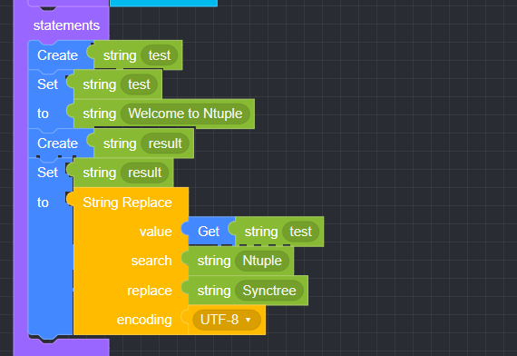
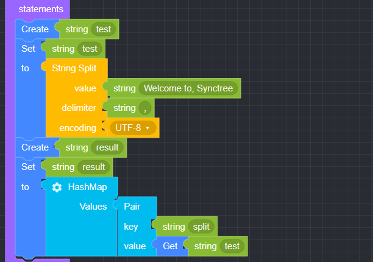

## String

### ● String Concat

        Used when consolidating multiple String strings into one


        You can add or delete items by clicking the settings button


#### ● Example

<p class='comment'>Studio Copy&Paste Available</p>
<iframe
    src="https://d1sxhpvag16wqc.cloudfront.net/v3.1.0/util/string_concat"
    width="100%"
    height="800px"
    allow=""
    sandbox="allow-scripts allow-same-origin" />
<div class="display-pdf">
    <p></p>
</div>

#### ● Result

```text
{
  "result": {
    "concat": "Welcome to Synctree"
  }
}
```

### ● String Index

        Used to find the position of the character you want to find in a string


#### ● Example

<p class='comment'>Studio Copy&Paste Available</p>
<iframe
    src="https://d1sxhpvag16wqc.cloudfront.net/v3.1.0/util/string_index"
    width="100%"
    height="800px"
    allow=""
    sandbox="allow-scripts allow-same-origin"/>
<div class="display-pdf">
    <p></p>
</div>

#### ● Result

```text
{
  "result": {
    "index": 11
  }
}
```

### ● String Format

        String formatting


        You can add or delete items by clicking the settings button


### ● String Charset Encode

        String encoding


### ● String Length

        Used to check the length of a string


#### ● Example

<p class='comment'>Studio Copy&Paste Available</p>
<iframe
    src="https://d1sxhpvag16wqc.cloudfront.net/v3.1.0/util/string_length"
    width="100%"
    height="800px"
    allow=""
    sandbox="allow-scripts allow-same-origin"/>
<div class="display-pdf">
    <p></p>
</div>

#### ● Result

```text
{
  "result": {
    "length": 19
  }
}
```

### ● String ToArray

        Used to return a string as an array


#### ● Example

<p class='comment'>Studio Copy&Paste Available</p>
<iframe
    src="https://d1sxhpvag16wqc.cloudfront.net/v3.1.0/util/string_toarray"
    width="100%"
    height="800px"
    allow=""
    sandbox="allow-scripts allow-same-origin"/>
<div class="display-pdf">
    <p></p>
</div>

#### ● Result

```text
{
  "result": {
    "string-to-array": [
      "W",
      "e",
      "l",
      "c",
      "o",
      "m",
      "e",
      " ",
      "t",
      "o",
      " ",
      "S",
      "y",
      "n",
      "c",
      "t",
      "r",
      "e",
      "e"
    ]
  }
}
```

### ● String Substring

        Used to extract a part of a string


#### ● Example

<p class='comment'>Studio Copy&Paste Available</p>
<iframe
    src="https://d1sxhpvag16wqc.cloudfront.net/v3.1.0/util/string_substring"
    width="100%"
    height="800px"
    allow=""
    sandbox="allow-scripts allow-same-origin"/>
<div class="display-pdf">
    <p></p>
</div>

#### ● Result

```text
{
  "result": {
    "substring": "Welcome to Synctre"
  }
}
```

### ● String Replace

        Used to change one character to another in a string


#### ● Example

<p class='comment'>Studio Copy&Paste Available</p>
<iframe
    src="https://d1sxhpvag16wqc.cloudfront.net/v3.1.0/util/string_replace"
    width="100%"
    height="800px"
    allow=""
    sandbox="allow-scripts allow-same-origin"/>
<div class="display-pdf">
    <p></p>
</div>

#### ● Result

```text
{
  "result": {
    "before": "Welcome to Ntuple",
    "replaced": "Welcome to Synctree"
  }
}
```

### ● String Replace-Regex

        Used to convert characters that match a regular expression pattern to a string


#### ● Example

<p class='comment'>Studio Copy&Paste Available</p>
<iframe
    src="https://d1sxhpvag16wqc.cloudfront.net/v3.1.0/util/string_replace_regex"
    width="100%"
    height="800px"
    allow=""
    sandbox="allow-scripts allow-same-origin"/>
<div class="display-pdf">
    <p></p>
</div>

#### ● Result

```text
{
  "result": "Replace matched sequence"
}
```

### ● String Split

        Used to split a string by separating a specific character in the string and output it as an array


#### ● Example

<p class='comment'>Studio Copy&Paste Available</p>
<iframe
    src="https://d1sxhpvag16wqc.cloudfront.net/v3.1.0/util/string_split"
    width="100%"
    height="800px"
    allow=""
    sandbox="allow-scripts allow-same-origin"/>
<div class="display-pdf">
    <p></p>
</div>

#### ● Result

```text
{
  "result": {
    "split": [
      "Welcome to",
      " Synctree"
    ]
  }
}
```

### ● String Split-Regex

        Used when splitting a string (regular expression)


#### ● Example

<p class='comment'>Studio Copy&Paste Available</p>
<iframe
    src="https://d1sxhpvag16wqc.cloudfront.net/v3.1.0/util/string_split_regex"
    width="100%"
    height="800px"
    allow=""
    sandbox="allow-scripts allow-same-origin"/>
<div class="display-pdf">
    <p></p>
</div>

#### ● Result

```text
{
  "result": {
    "str": "hypertext language, programming",
    "match": [
      "hypertext language",
      " programming"
    ],
    "matchArrCnt": 2
  }
}
```

### ● String LTrim

        Used to remove whitespace from the left side of a string


#### ● Example

<p class='comment'>Studio Copy&Paste Available</p>
<iframe
    src="https://d1sxhpvag16wqc.cloudfront.net/v3.1.0/util/string_ltrim"
    width="100%"
    height="800px"
    allow=""
    sandbox="allow-scripts allow-same-origin"/>
<div class="display-pdf">
    <p></p>
</div>

#### ● Result

```text
{
  "result": {
    "ltrim": "Welcome to Synctree"
  }
}
```

### ● String RTrim

        Used to remove whitespace on the right side of a string


#### ● Example

<p class='comment'>Studio Copy&Paste Available</p>
<iframe
    src="https://d1sxhpvag16wqc.cloudfront.net/v3.1.0/util/string_rtrim"
    width="100%"
    height="800px"
    allow=""
    sandbox="allow-scripts allow-same-origin"/>
<div class="display-pdf">
    <p></p>
</div>

#### ● Result

```text
{
  "result": {
    "rtrim": "Welcome to Synctree"
  }
}
```
