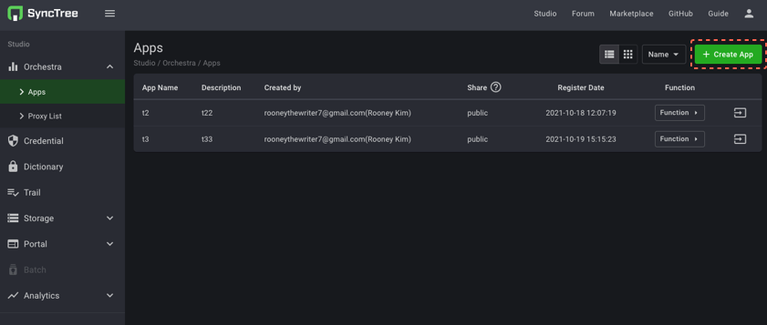
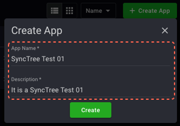
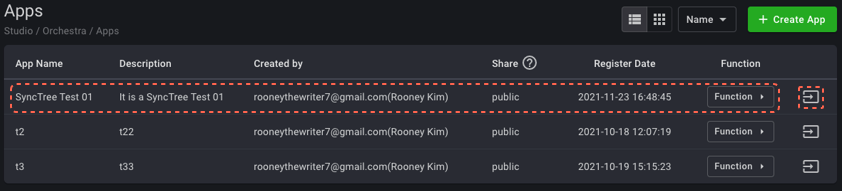
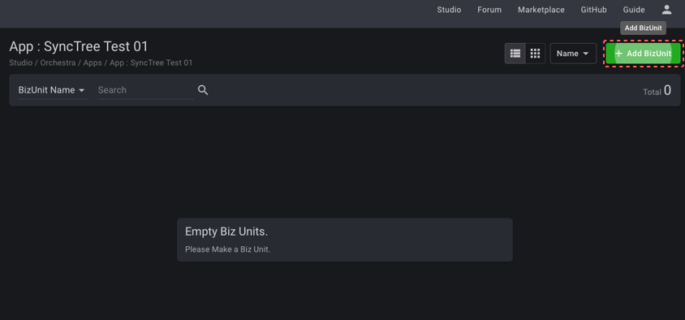
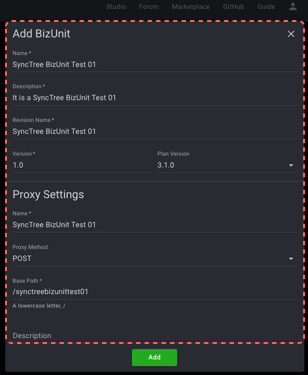
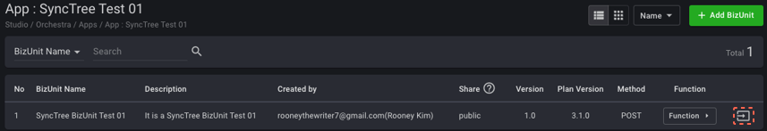
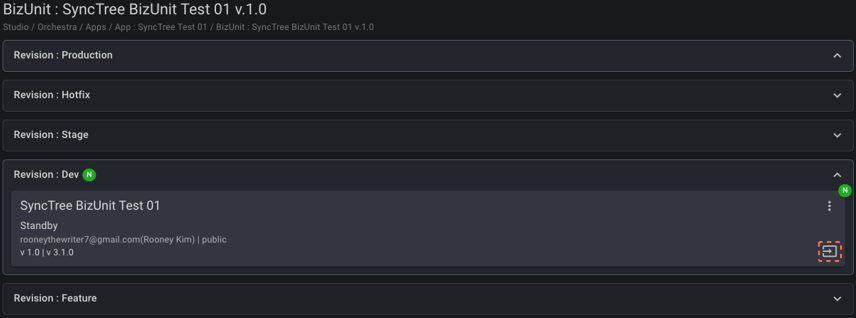

#### STEP 2-3

1. Create App 누르고 앱을 하나 생성합니다.
2. 이후, 앱 정보를 넣은 후 Create 버튼을 눌러주고,
3. Apps에 생성된 자신의 앱의 맨우측 화살표를 눌러 이동합니다.

    1
    
    2
    
    3
    

#### STEP 2-4

1. Add BizUnIt 누르고 비즈유닛 하나 생성한 뒤
2. Add BizUnit과 Proxy Setting 양식을 작성합니다.

    1
    
    2
    

#### STEP 2-5

1. App 내에서 우측 끝의 화살표 버튼을 누릅니다.
2. 이후, Revision: Dev 박스의 우측 하단 화살표 버튼을 누릅니다.

    1
    
    2
    

