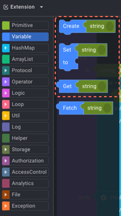
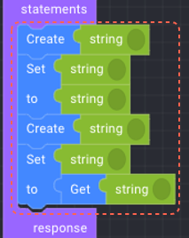
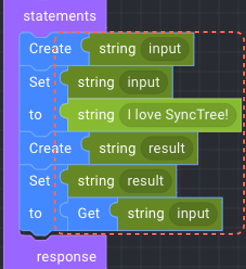
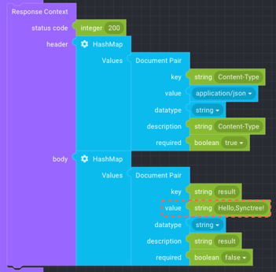
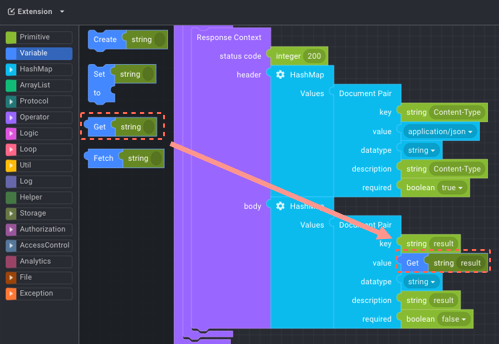

## API 편집

#### STEP 2-6

##### 1. 블록코딩

좌측 블록타입에서 Variable을 누른 후 ‘Create’ 블럭과 ‘Set/ to’ 블럭을 선택하여 ‘Statements’에 넣고,
Primitive 에서 string을 불러와서 ‘Set/to’의 to에 넣습니다.
그리고 동일한 ‘Create’ 블럭과 ‘Set/to’ 블럭을 다시 선택하여 방금 넣었던 ‘Create’블럭과 ‘Set, to’ 블럭 아래에 넣고,
Variable에서 ‘Get/string’을 가져와서 두번째 ‘Set/to’ 블럭의 to 우측에 ‘Get/string’블럭을 넣습니다.

##### 2. 변수값 넣기

Create과 Set블럭의 string의 각 변수값에 ‘input’을 쓰고 to블럭의 string에 ‘I love SyncTree!’ 씁니다.
아래 Create 블럭과 Set 블럭의 string에 ‘result’를 쓰고, to/Get 블럭의 string에 ‘input’을 씁니다.

    1
    2
    3
    
    
    

#### STEP 2-7

1. 아래 Response Context의 body의 두번째 Document Pair에서 value에 붙어있는 string을 제거하고,
2. Variable에서 ‘Get string’을 가져와 붙입니다. 그리고 string에 ‘result’를 넣습니다.

    1
    2
    
    

