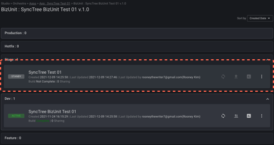
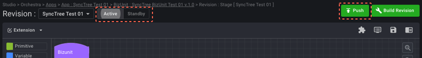
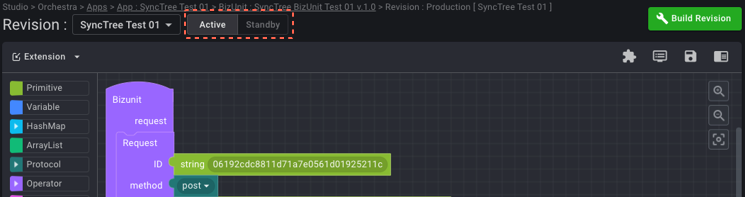

## API 푸시하기 (단계별 Revision)

#### STEP 9

1. 다시 Orchestra > Apps > 자신의 BizUnit으로 와서 ‘Change Revision Status’ 눌러 상태를 ‘ACTIVE’로 바꿔 줍니다.
2. 이후, ‘Push/Copy Revision’에서 ‘Push to Stage’를 눌러 Revision Name과 Comment를 작성하고 배포합니다.

    1
    
    2
    

#### STEP 10

1. Stage에 새로운 박스가 하나 생성되었습니다. 이 박스를 클릭한 뒤 들어갑니다.
2. 이후 세이브 버튼 > Build Revision > Test버튼을 차례로 누르고 화면이 열리면 Run버튼을 눌러줍니다. 그리고 좌측 상단의 ‘ACTIVE’ 박스를 누르고 우측 상단의 ‘Push’ 버튼을 눌러 배포합니다.

    1
    
    2
    
    3
    

#### STEP 11

1. Production 박스를 클릭하고 들어온 뒤,
2. 세이브 버튼 > Build Revision > Test버튼을 차례로 누르고 화면이 열리면 Run버튼을 눌러줍니다.
3. 이후, 좌측 상단의 ‘ACTIVE’ 박스를 눌러줍니다.

    1
    
    2
    
    3
    

