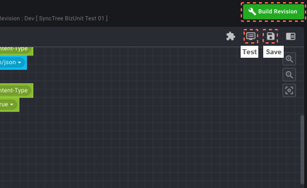
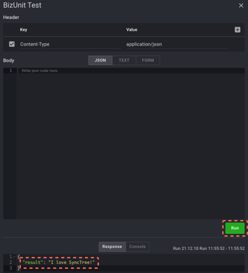

## API 테스트

#### STEP 2-8

1. 우측 상단의 ‘세이브 버튼’을 눌러 저장하고 ‘Build Revision’을 눌러 빌드하고, 세이브 버튼 좌측에 ‘Test’ 버튼이 활성화되면 버튼을 눌러 Test창을 엽니다.
2. 이후, 화면이 열리면 ‘Run’ 버튼을 눌러줍니다. ‘I love SyncTree!’가 성공적으로 실행됩니다.

    1
    
    2
    

