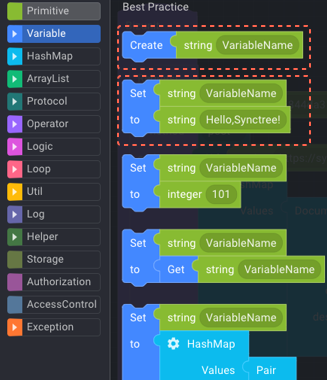
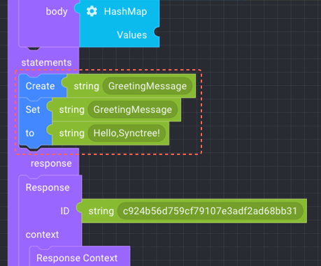
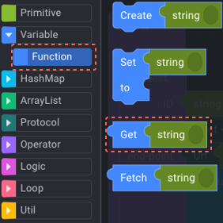
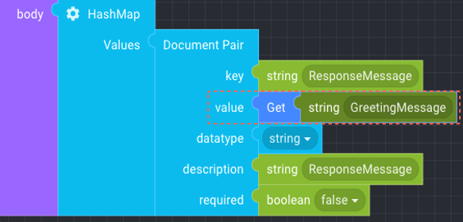

#### STEP 1-2

1. 좌측 블록타입의 Variable에서 ‘Create’ 블럭을 불러온 뒤, statement에 넣고 GreetingMessage를 씁니다.
2. 이후, Variable에서 Create 블럭 아래의 ‘Set to’ 블럭을 선택하여 ‘Create’ 아래에 넣고 Set 옆의 string에 GreetingMessage를 씁니다.

     1
     2
     
     
 

#### STEP 1-3

다시, Variable의 Function에서 ‘Get string’ 블럭을 가져와 아래의 ‘Document Pair>value에 넣고,
string에 ‘GreetingMessage’를 씁니다.

    
    

