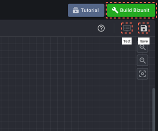

#### STEP 1-4

1. 우측 상단의 ‘세이브 버튼’을 눌러 저장하고 ‘Build Bizunit’을 눌러 빌드한 뒤, 세이브 버튼 좌측에 ‘Test’ 버튼이
   활성화되면 눌러줍니다.
2. 이후, 화면이 열리면 ‘Run’ 버튼을 눌러줍니다. 드디어, Hello,SyncTree!가 실행되었습니다!
   본격적인 API 개발을 원하시면 다음 단계를 통해 싱크트리 스튜디오에 가입하고 싱크트리 스튜디오를 활용하세요.

    1
    2
    
    

