## SyncTree 사용법

### STEP 1: SyncTree 플레이그라운드 체험하기 (Hello SyncTree 만들기)

#### STEP 1-1

[SyncTree 플레이그라운드](https://playground.synctreestudio.com/#/) 내 Try ‘Hello,SyncTree’ 페이지로 이동합니다.

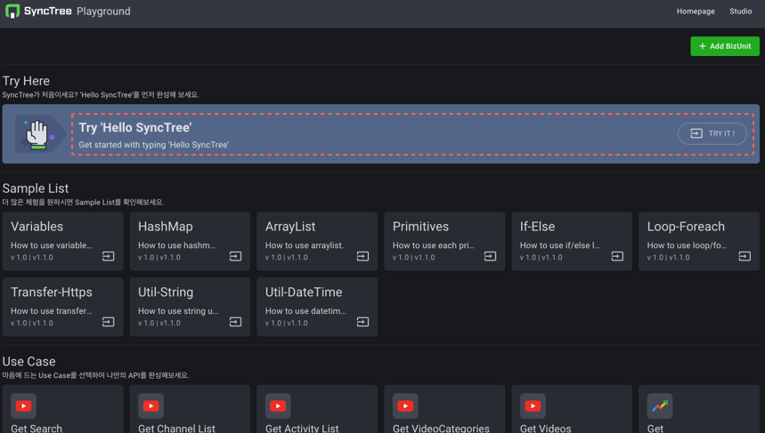

#### STEP 1-2

1. 좌측 블록타입의 Variable에서 ‘Create’ 블럭을 불러온 뒤, statement에 넣고 GreetingMessage를 씁니다.
2. 이후, Variable에서 Create 블럭 아래의 ‘Set to’ 블럭을 선택하여 ‘Create’ 아래에 넣고 Set 옆의 string에
   GreetingMessage를 씁니다.

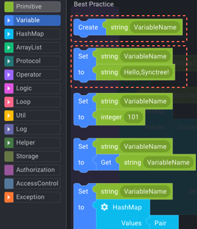
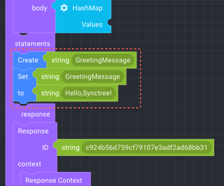

#### STEP 1-3

다시, Variable의 Function에서 ‘Get string’ 블럭을 가져와 아래의 ‘Document Pair>value에 넣고,
string에 ‘GreetingMessage’를 씁니다.

#### STEP 1-4

1. 우측 상단의 ‘세이브 버튼’을 눌러 저장하고 ‘Build Bizunit’을 눌러 빌드한 뒤, 세이브 버튼 좌측에 ‘Test’ 버튼이
   활성화되면 눌러줍니다.
2. 이후, 화면이 열리면 ‘Run’ 버튼을 눌러줍니다. 드디어, Hello,SyncTree!가 실행되었습니다!
   본격적인 API 개발을 원하시면 다음 단계를 통해 SyncTree 스튜디오에 가입하고 SyncTree 스튜디오를 활용하세요.

## SyncTree 사용법 따라하기!

### STEP 2: SyncTree Studio 가입 후 ‘나만의 API’ 만들어보기

#### 가입하기

#### STEP 2-1

Sign up for free를 누른 뒤, 가입 양식 작성하고 가입합니다.

#### STEP 2-2

1. 이메일에서 어카운트 넘버를 확인한 뒤,
2. 어카운트 넘버/ID/패스워드를 입력 후 로그인합니다.

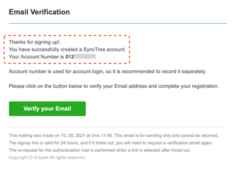

#### STEP 2-3

1. Create App 누르고 앱을 하나 생성합니다.
2. 이후, 앱 정보를 넣은 후 Create 버튼을 눌러주고,
3. Apps에 생성된 자신의 앱의 맨우측 화살표를 눌러 이동합니다.

#### STEP 2-4

1. Add BizUnIt 누르고 비즈유닛 하나 생성한 뒤
2. Add BizUnit과 Proxy Setting 양식을 작성합니다.

#### STEP 2-5

1. App 내에서 우측 끝의 화살표 버튼을 누름
2. 이후, Revision: Dev 박스의 우측 하단 화살표 버튼을 누름

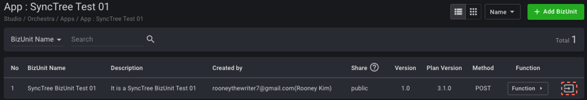
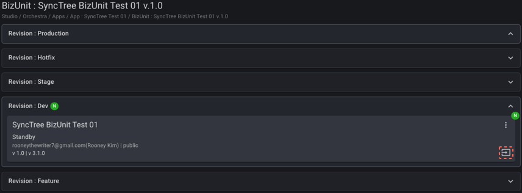

## API 편집

#### STEP 2-6

1. 블록코딩

좌측 블록타입에서 Variable을 누른 후 ‘Create’ 블럭과 ‘Set/ to’ 블럭을 선택하여 ‘Statements’에 넣고,
Primitive 에서 string을 불러와서 ‘Set/to’의 to에 넣습니다.
그리고 동일한 ‘Create’ 블럭과 ‘Set/to’ 블럭을 다시 선택하여 방금 넣었던 ‘Create’블럭과 ‘Set, to’ 블럭 아래에 넣고,
Variable에서 ‘Get/string’을 가져와서 두번째 ‘Set/to’ 블럭의 to 우측에 ‘Get/string’블럭을 넣습니다.

2. 변수값 넣기

Create과 Set블럭의 string의 각 변수값에 ‘input’을 쓰고 to블럭의 string에 ‘I love SyncTree!’ 씁니다.
아래 Create 블럭과 Set 블럭의 string에 ‘result’를 쓰고, to/Get 블럭의 string에 ‘input’을 씁니다.

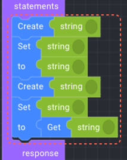
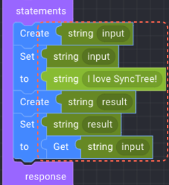

#### STEP 2-7

1. 아래 Response Context의 body의 두번째 Document Pair에서 value에 붙어있는 string을 제거하고,
2. Variable에서 ‘Get string’을 가져와 붙인다. 그리고 string에 ‘result’를 넣는다.

## API 테스트

#### STEP 2-8

1. 우측 상단의 ‘세이브 버튼’을 눌러 저장하고 ‘Build Revision’을 눌러 빌드하고, 세이브 버튼 좌측에 ‘Test’ 버튼이 활성화되면 눌러 줌.
2. 이후, 화면이 열리면 ‘Run’ 버튼을 눌러줌. ‘I love SyncTree!’가 성공적으로 실행됨.

## API 푸시하기 (단계별 Revision)

#### STEP 2-9

1. 다시 Orchestra > Apps > 자신의 BizUnit으로 와서 ‘Change Revision Status’ 눌러 상태를 ‘ACTIVE’로 바꿔 줍니다.
2. 이후, ‘Push/Copy Revision’에서 ‘Push to Stage’를 눌러 Revision Name와 Comment를 작성하고 배포합니다.

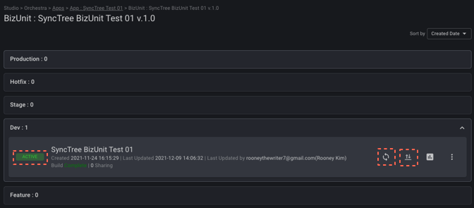

#### STEP 2-10

1. Stage에 새로운 박스가 하나 생성되었습니다. 이 박스를 클릭한 뒤 들어갑니다.
2. 이후 세이브 버튼 > Build Revision > Test버튼을 차례로 누르고 화면이 열리면 Run버튼을 눌러줍니다. 그리고 좌측 상단의 ‘ACTIVE’ 박스를 누르고 우측 상단의 ‘Push’ 버튼을 눌러 배포합니다.

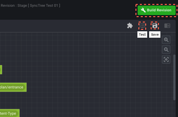

#### STEP 2-11

1. Production 박스를 클릭하고 들어온 뒤,
2. 세이브 버튼 > Build Revision > Test버튼을 차례로 누르고 화면이 열리면 Run버튼을 눌러줍니다.
3. 이후, 좌측 상단의 ‘ACTIVE’ 박스를 눌러줍니다.

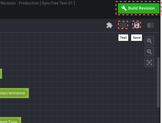

## 포탈 생성 및 에 API 등록

#### STEP 2-12

1. Manage API로 이동 후 Create API 버튼을 눌러서 이동합니다.
2. 이후, API Details 작성한 뒤 Create 버튼을 클릭합니다.
3. 그리고 하단의 API Resources를 눌러서 만들어놓은 BizUnit을 선택합니다.

#### STEP 2-13

1. Access Protal로 이동하여 Portal link를 눌러 Portal로 이동합니다.

## 포탈 가입 및 API 확인

#### STEP 2-14

1. Portal로 이동 이후, Sign up 한 뒤 내 포탈 계정을 만듭니다.
2. 이후, Detail을 눌러 이동하면 End Point에서 자신이 생성한 API URL을 확인할 수 있습니다. 끝!

