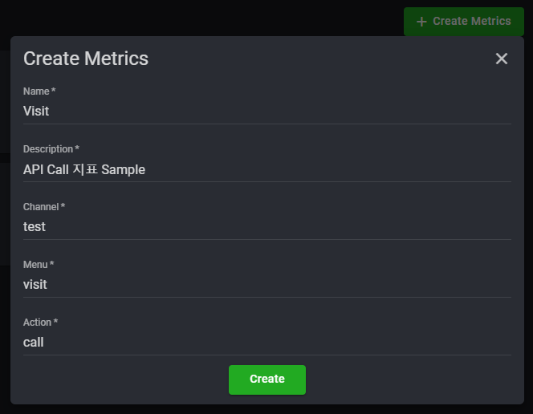
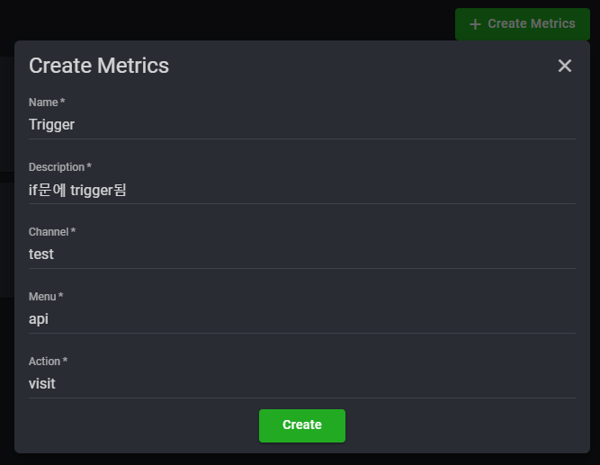
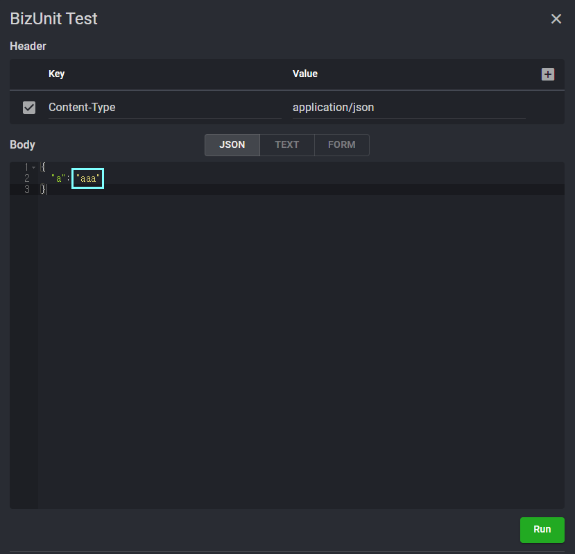
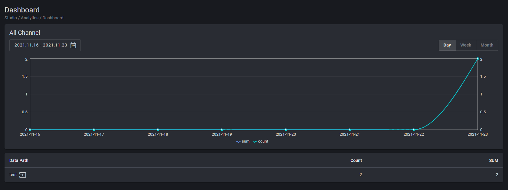
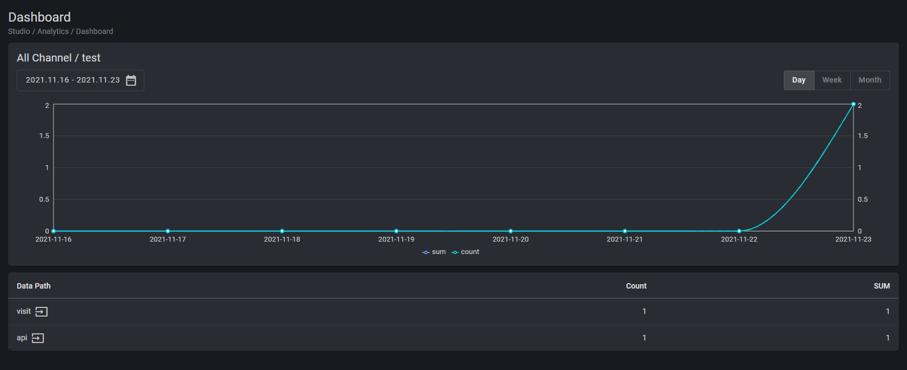
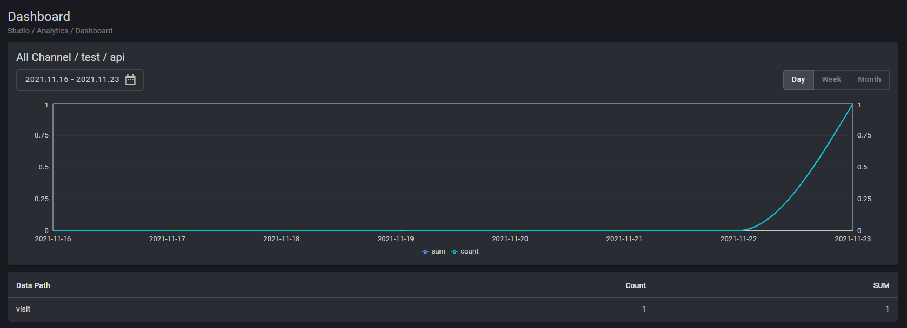
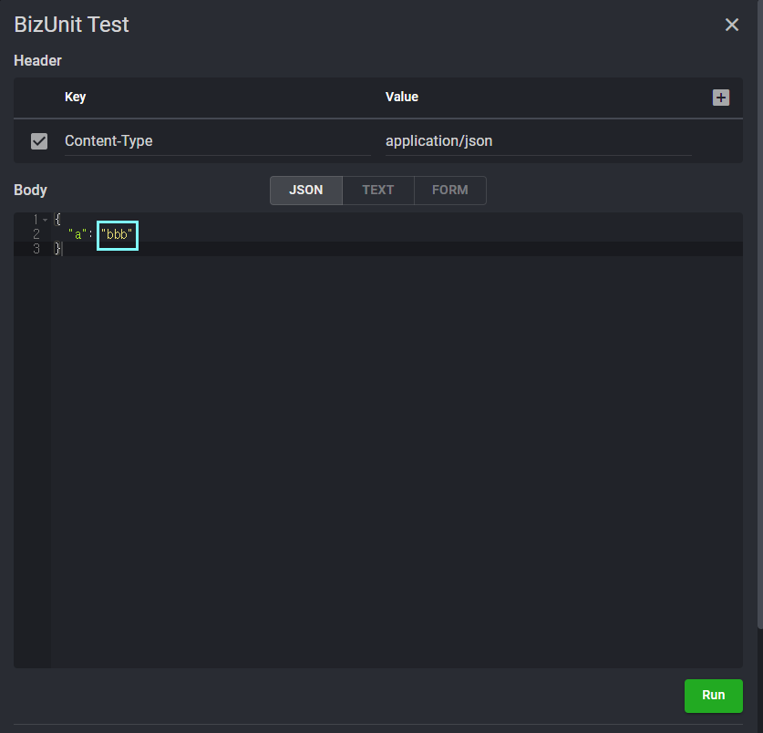
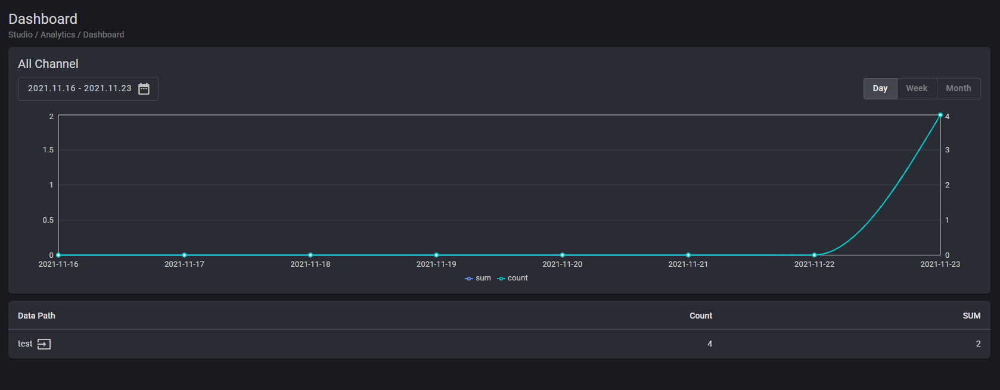
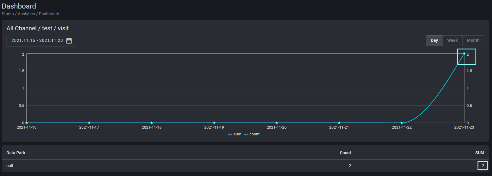

## Analytics

### ● Analytics Event

    이벤트 발생 시 상호작용에 대한 데이터를 수집

#### ● 예문

    1. Studio > Analytics > Custom Metrics > Create Metrics

    2. 생성된 Metrics ID 값 확인

Studio Copy&Paste 가능

<iframe
    src="https://d1sxhpvag16wqc.cloudfront.net/v3.1.0/analytics/analytics"
    width="100%"
    height="800px"
    allow=""
    sandbox="allow-scripts allow-same-origin" />

    

    

    3. "aaa"를 입력하여 Trigger Metrics > test Channel > visit Menu > "call" Action +1 카운트

    Metrics > "Channel" Level

    Metrics > Channel > "Menu" Level

    Metrics > Channel > Menu > Action Level > "call"

    Metrics > Channel > Menu > Action Level > "visit"

    4. "bbb"를 입력하여 Trigger Metrics > test Channel > visit Menu > "call" Action -1 카운트

    Metrics > "Channel" Level

    Metrics > Channel > "Menu" Level

    Metrics > Channel > Menu > Action Level > "call"

    Metrics > Channel > Menu > Action Level > "visit"

