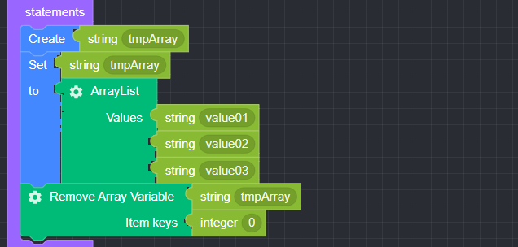
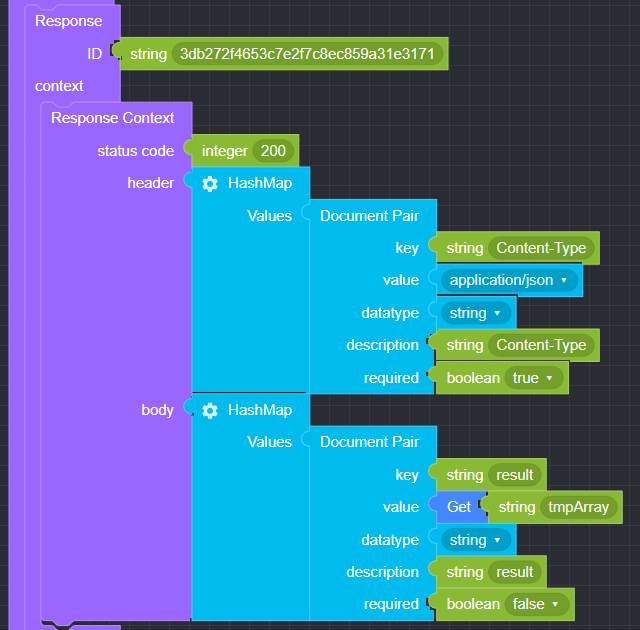

## Remove Array Variable

### ● **Remove Array Variable**

        배열형 변수값 또는 배열의 특정 키값을 삭제할 때 사용


        설정 버튼을 클릭하여 item을 추가 또는 삭제 가능


### ● \***\*Remove Array Variable **예문\*\*

<p class='comment'>Studio Copy&Paste 가능</p>
<iframe
    src="https://d1sxhpvag16wqc.cloudfront.net/v3.1.0/arrayList/remove_arraylist"
    width="100%"
    height="800px"
    allow=""
    sandbox="allow-scripts allow-same-origin" />
<div class="display-pdf">
    <p></p>
    <p></p>
</div>

### ● \***\*Remove Array Variable **결과\*\*

```text
{
  "result": [
    "value02",
    "value03"
  ]
}
```
