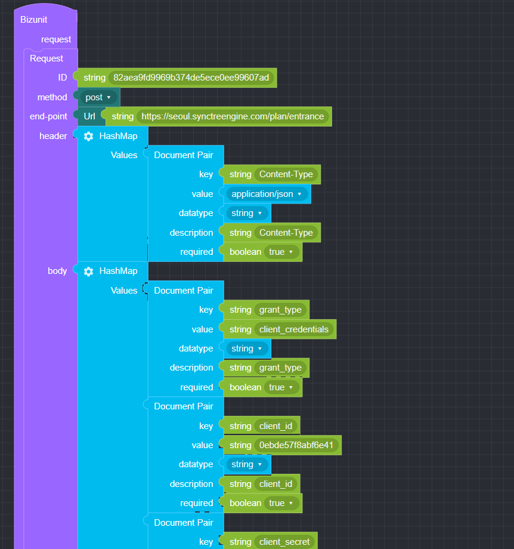
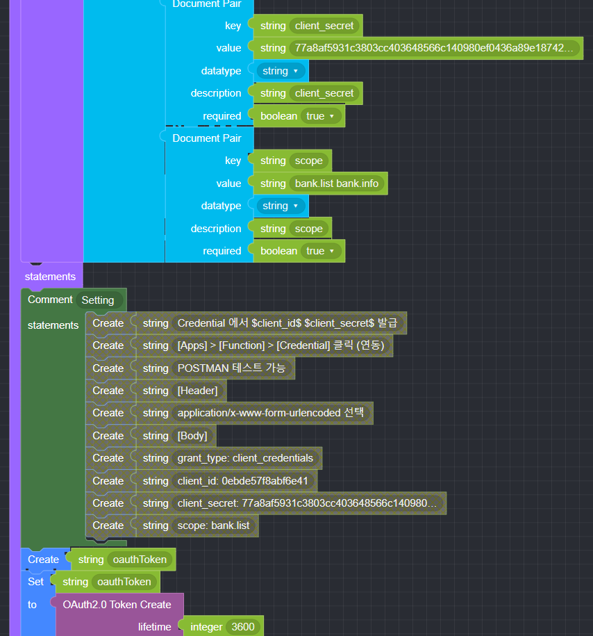
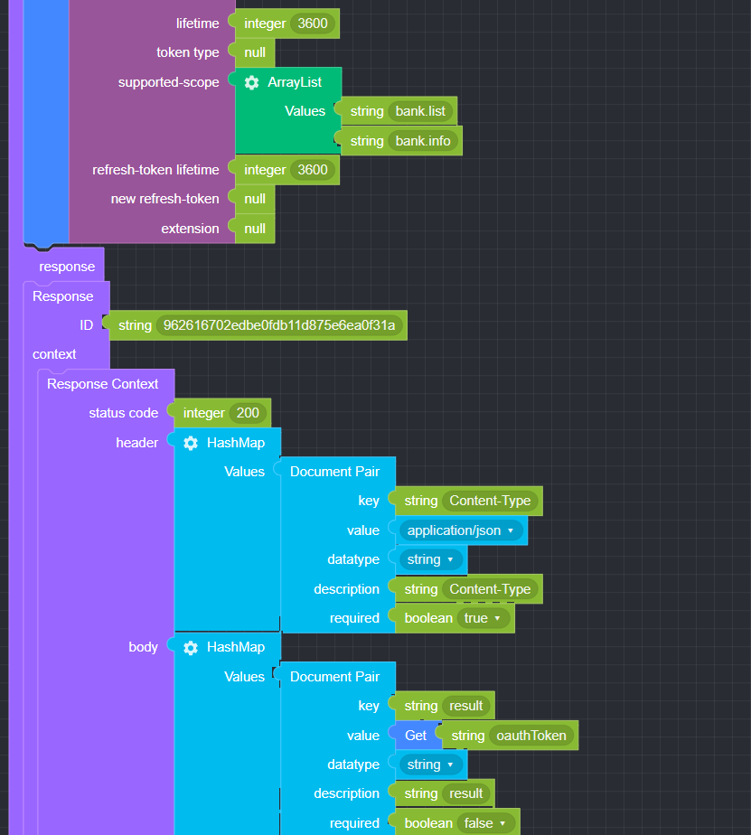
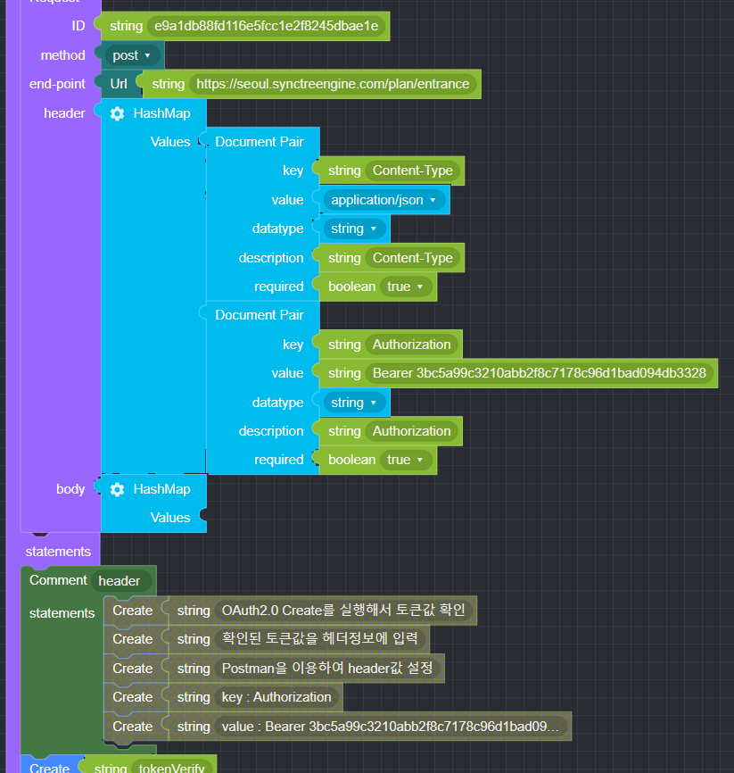
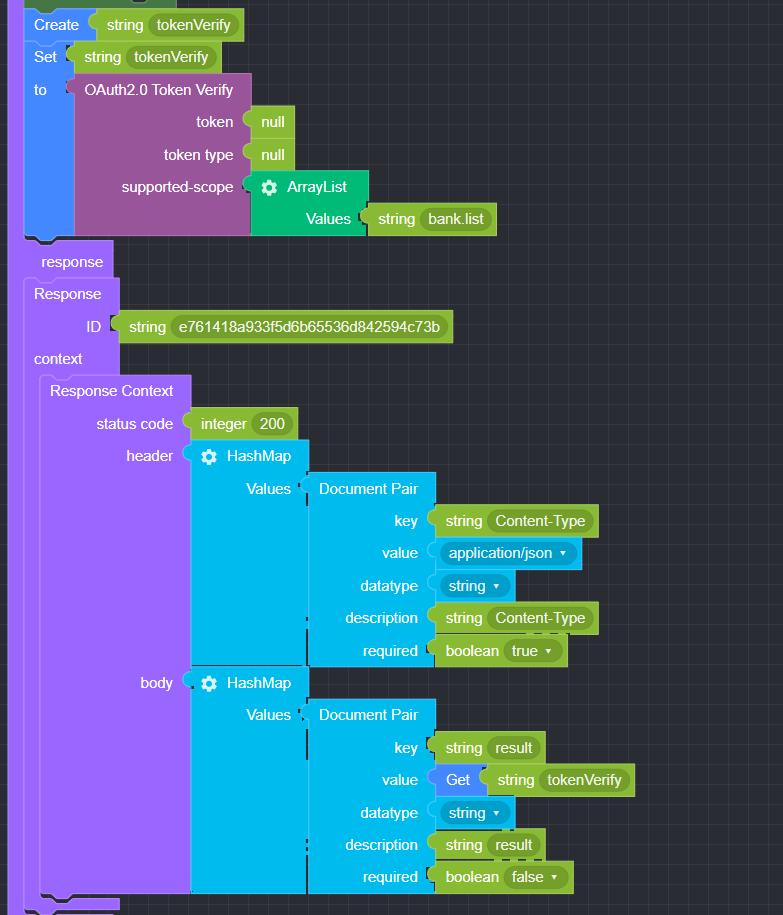
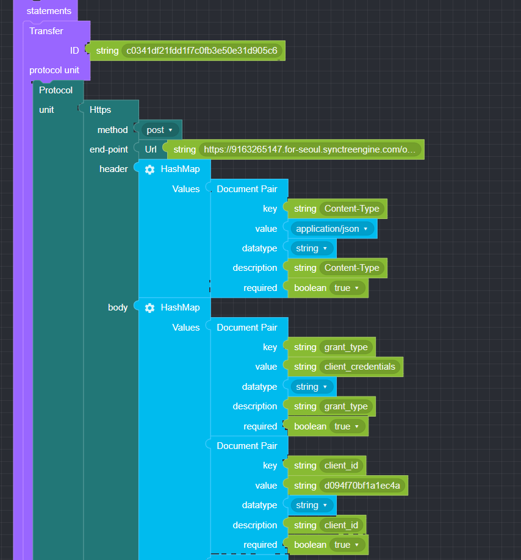
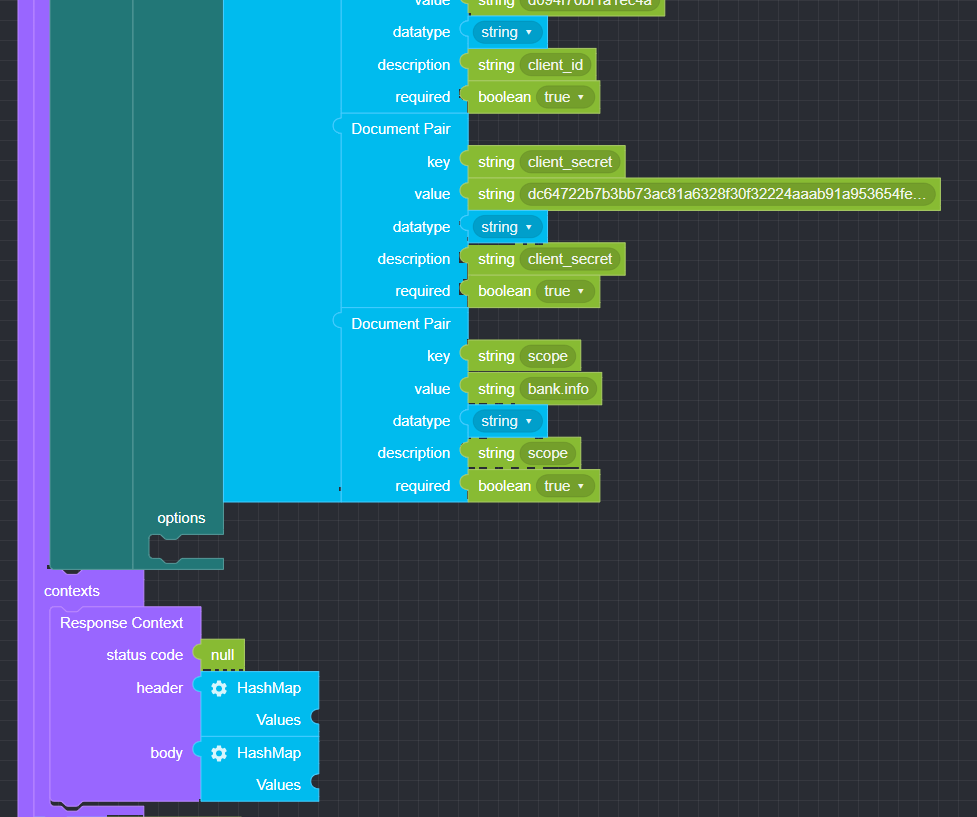
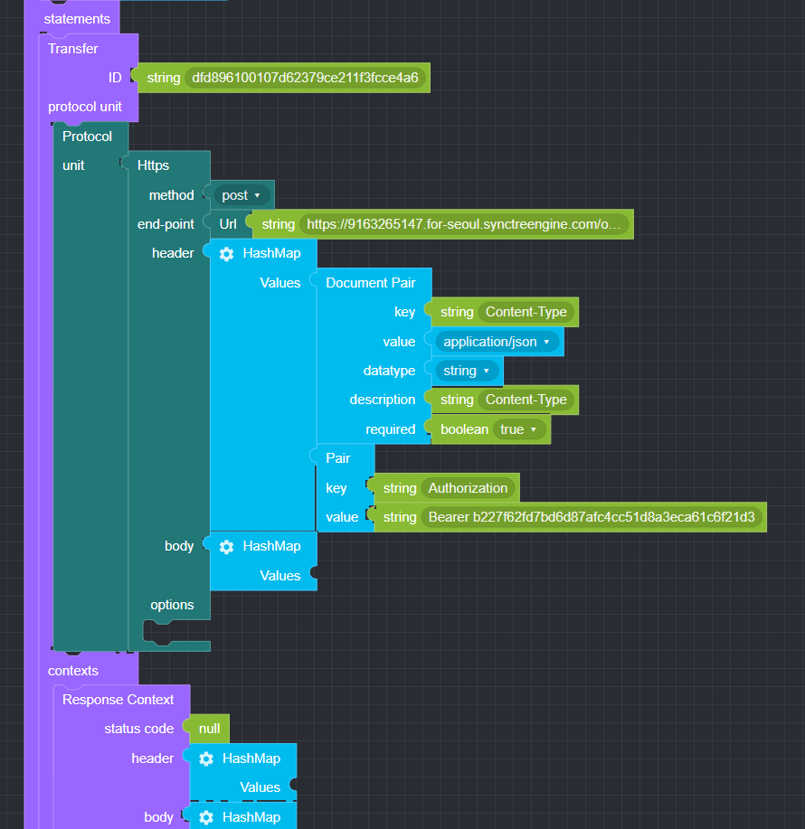
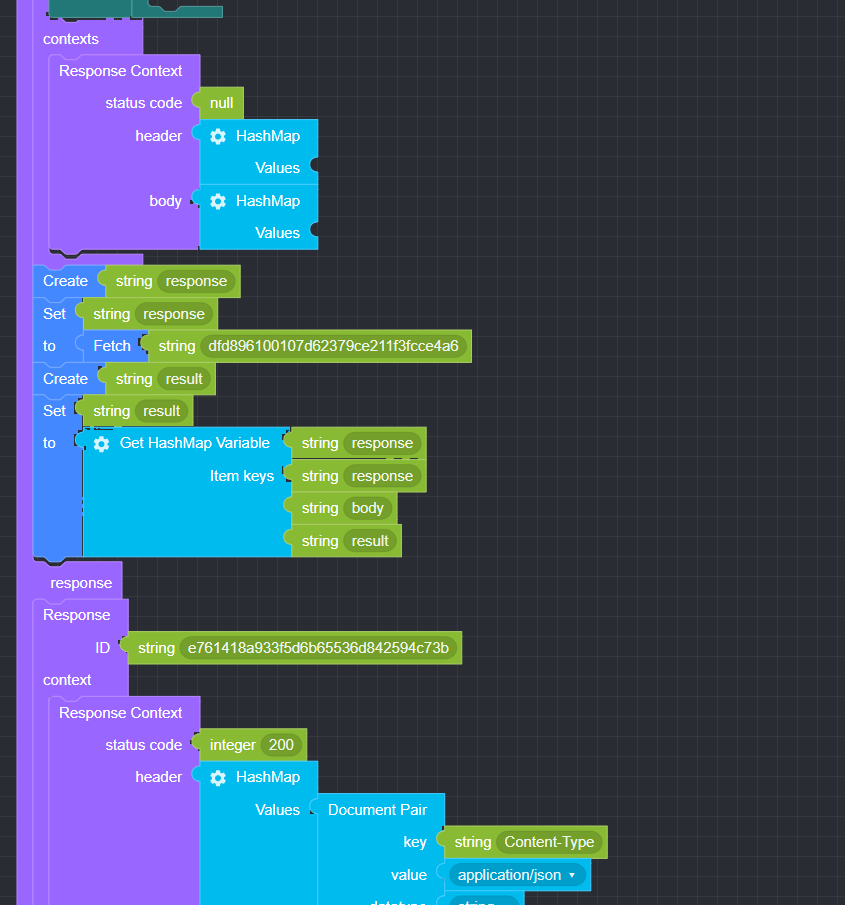
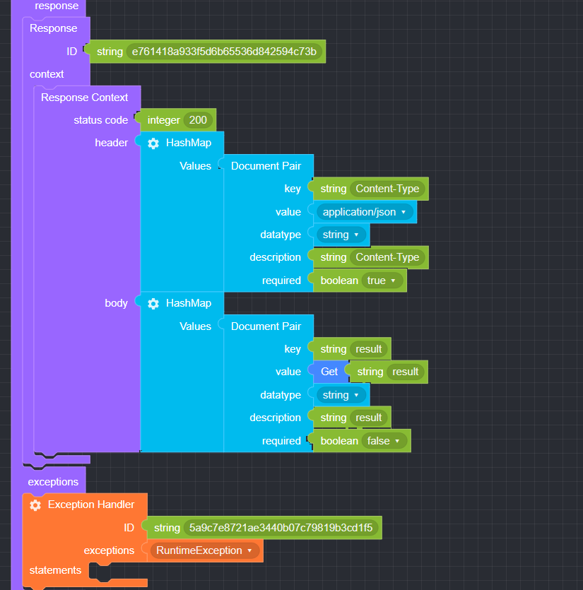

## OAuth(2.0)

### ● OAuth2.0 Authorize

        OAuth Authorization 생성


### ● OAuth2.0 Token Create

        OAuth Token 생성


### ● OAuth2.0 Token Verify

        OAuth Token 인증


### ● OAuth2.0 Token Revoke

        OAuth Token 폐기


### ● OAuth JWT Token Type

        JSON Web Token 타입 \(JWS, JWE\)


### ● JWT Payload

        JSON Web Token 클레임 \(Name, Value\)


### ● SAML2 Bearer Assertion

        SAML Assertion 발급


### ● OAuth 2.0 Creation 예문

<p class='comment'>Studio Copy&Paste 가능</p>
<iframe
    src="https://d1sxhpvag16wqc.cloudfront.net/v3.1.0/authorization/oauth2.0_create"
    width="100%"
    height="800px"
    allow=""
    sandbox="allow-scripts allow-same-origin" />
<div class="display-pdf">
    <p></p>
    <p></p>
    <p></p>
</div>

### ● 결과

```text
{
  "result": {
    "access_token": "3bc5a99c3210abb2f8c7178c96d1bad094db3328",
    "expires_in": 3600,
    "token_type": "Bearer",
    "scope": "bank.list bank.info"
  }
}
```

### ● OAuth 2.0 Verification 예문

<p class='comment'>Studio Copy&Paste 가능</p>
<iframe
    src="https://d1sxhpvag16wqc.cloudfront.net/v3.1.0/authorization/oauth2.0_verify"
    width="100%"
    height="800px"
    allow=""
    sandbox="allow-scripts allow-same-origin" />
<div class="display-pdf">
    <p></p>
    <p></p>
</div>

### ● 결과

```text
{
  "result": {
    "access_token": "3bc5a99c3210abb2f8c7178c96d1bad094db3328",
    "client_id": "8b0a1700aaa109cf",
    "expires": 1632377382,
    "scope": "bank.list bank.info"
  }
}
```

### ● OAuth 2.0 Client Creation 예문

<p class='comment'>Studio Copy&Paste 가능</p>
<iframe
    src="https://d1sxhpvag16wqc.cloudfront.net/v3.1.0/authorization/oauth2.0_client_create"
    width="100%"
    height="800px"
    allow=""
    sandbox="allow-scripts allow-same-origin" />
<div class="display-pdf">
    <p></p>
    <p></p>
    <p></p>
</div>

### ● 결과

```text
{
  "createdToken": {
    "access_token": "b227f62fd7bd6d87afc4cc51d8a3eca61c6f21d3",
    "expires_in": 3600,
    "token_type": "Bearer",
    "scope": "bank.info"
  }
}
```

### ● OAuth 2.0 Client Verificiation 예문

<p class='comment'>Studio Copy&Paste 가능</p>
<iframe
    src="https://d1sxhpvag16wqc.cloudfront.net/v3.1.0/authorization/oauth2.0_client_verify"
    width="100%"
    height="800px"
    allow=""
    sandbox="allow-scripts allow-same-origin" />
<div class="display-pdf">
    <p></p>
    <p></p>
    <p></p>
</div>

### ● 결과

```text
{
  "result": {
    "access_token": "b227f62fd7bd6d87afc4cc51d8a3eca61c6f21d3",
    "client_id": "d094f70bf1a1ec4a",
    "expires": 1632380527,
    "scope": "bank.info"
  }
}
```
