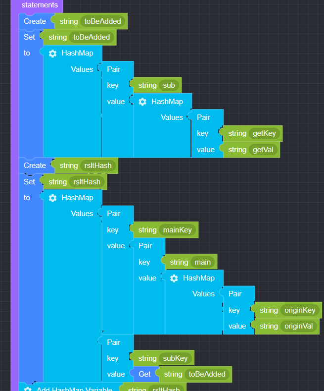
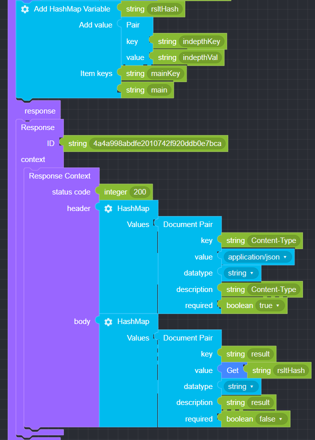

## Add HashMap Variable

### ● Add HashMap Variable

        HashMap에 key, value를 추가할 때 사용


        설정 버튼을 클릭하여 item을 추가 또는 삭제 가능


### ● \***\*Add HashMap **예문\*\*

<p class='comment'>Studio Copy&Paste 가능</p>
<iframe
    src="https://d1sxhpvag16wqc.cloudfront.net/v3.1.0/hashmap/add_hashmap"
    width="100%"
    height="800px"
    allow=""
    sandbox="allow-scripts allow-same-origin" />
<div class="display-pdf">
    <p></p>
    <p></p>
</div>

### ● \***\*Add HashMap **결과\*\*

```text
{
  "result": {
    "mainKey": {
      "main": {
        "originKey": "originVal",
        "indepthKey": "indepthVal"
      }
    },
    "subKey": {
      "sub": {
        "getKey": "getVal"
      }
    }
  }
}
```
