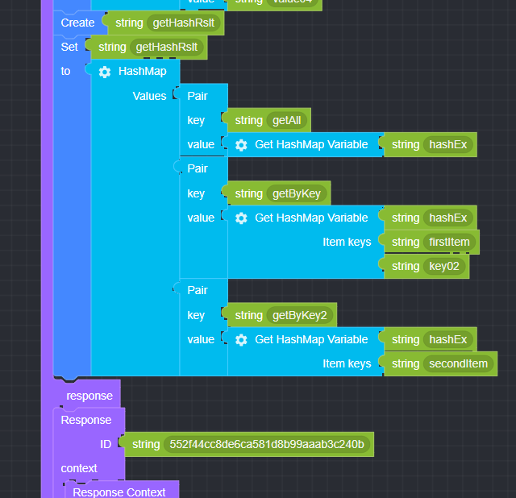

## Get HashMap Variable

### ● Get HashMap Variable

        HashMap 전체 또는 특정 키의 값을 가져올 때 사용


        설정 버튼을 클릭하여 item을 추가 또는 삭제 가능


### ● \***\*Get HashMap **예문\*\*

<p class='comment'>Studio Copy&Paste 가능</p>
<iframe
    src="https://d1sxhpvag16wqc.cloudfront.net/v3.1.0/hashmap/get_hashmap"
    width="100%"
    height="800px"
    allow=""
    sandbox="allow-scripts allow-same-origin" />
<div class="display-pdf">
    <p></p>
    <p></p>
</div>

### ● \***\*Get HashMap **결과\*\*

```text
{
  "result": {
    "getAll": {
      "firstItem": {
        "key01": "value01",
        "key02": "value02",
        "key03": "value03"
      },
      "secondItem": "value04"
    },
    "getByKey": "value02",
    "getByKey2": "value04"
  }
}
```
