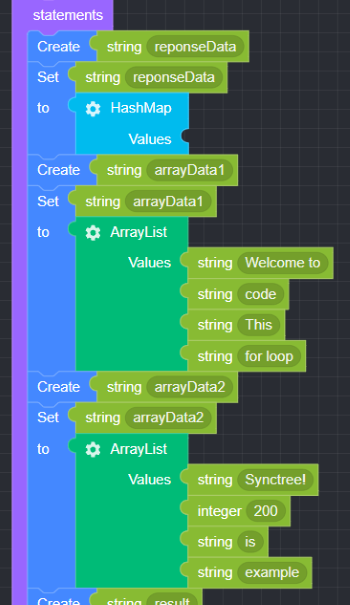
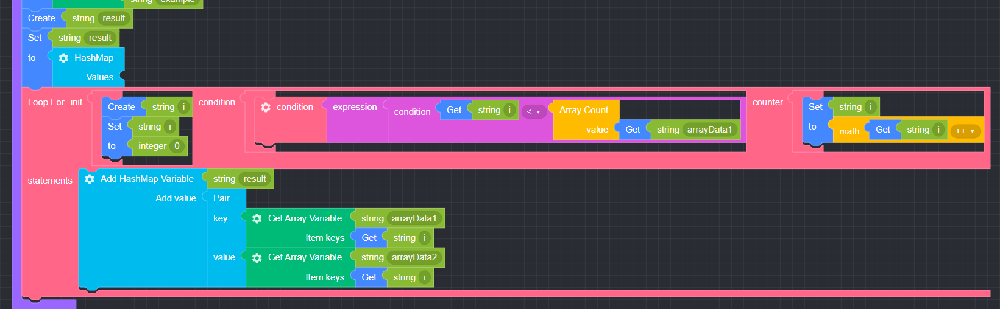
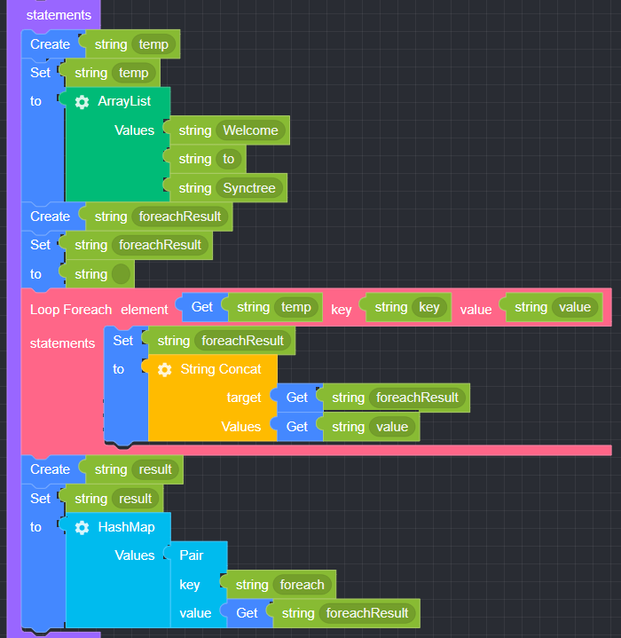
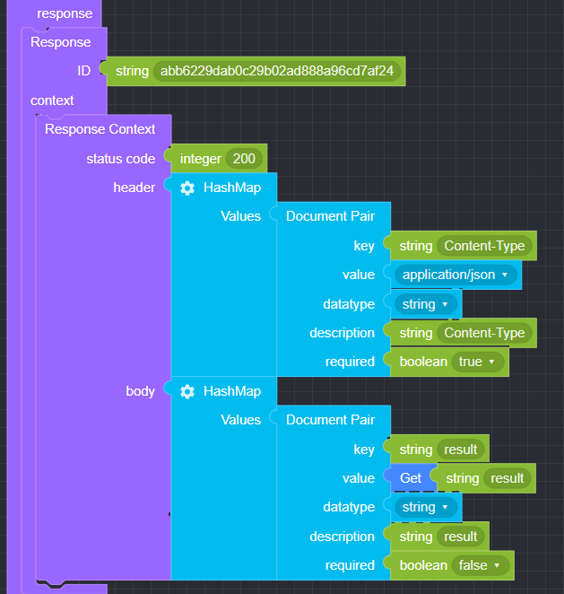

## Loop

### ● For

       조건식이 참일 때까지 반복적으로 작업을 진행하는 반복문


#### ● \***\***예제\*\*

<p class='comment'>Studio Copy&Paste 가능</p>
<iframe
    src="https://d1sxhpvag16wqc.cloudfront.net/v3.1.0/loop/for_loop"
    width="100%"
    height="800px"
    allow=""
    sandbox="allow-scripts allow-same-origin" />
<div class="display-pdf">
    <p></p>
    <p></p>
</div>

#### ● \***\***결과\*\*

```text
{
  "result": {
    "Welcome to": "Synctree!",
    "code": 200,
    "This": "is",
    "for loop": "example"
  }
}
```

### ● Foreach

       배열의 원소나 객체의 프로퍼티 수만큼 반복하는 동작에 사용


#### ● \***\***예제\*\*

<p class='comment'>Studio Copy&Paste 가능</p>
<iframe
    src="https://d1sxhpvag16wqc.cloudfront.net/v3.1.0/loop/foreach_loop"
    width="100%"
    height="800px"
    allow=""
    sandbox="allow-scripts allow-same-origin" />
<div class="display-pdf">
    <p></p>
    <p></p>
</div>

#### ● \***\***결과\*\*

```text
{
  "result": {
    "foreach": "Welcome to Synctree!"
  }
}
```

### ● Control

#### break

       반복문 제어: 제어흐름을 벗어날 때 사용


#### continue

       반복문 제어: 제어흐름을 유지고 현재 부분을 건너뛰고 다음 구문을 진행 시 사용


