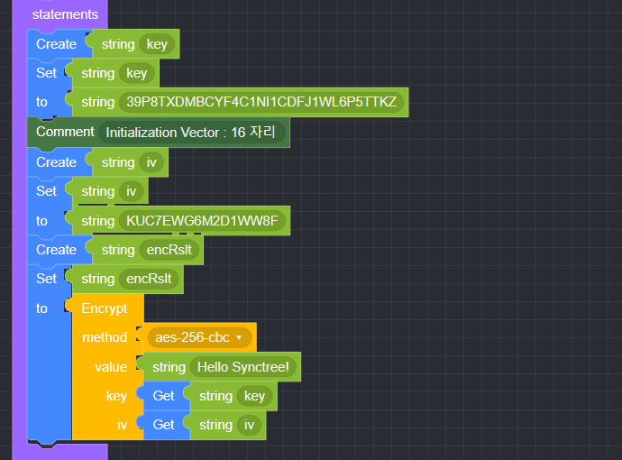
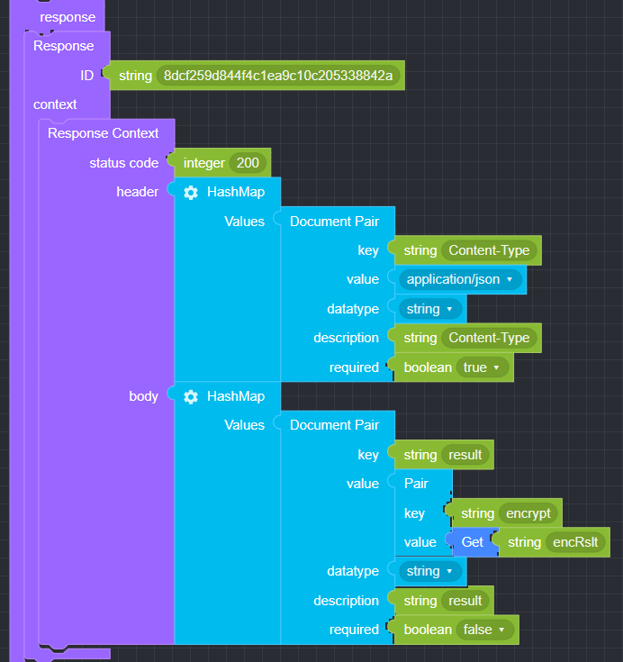

# Crypto

## ● Encrypt

       문자열을 인코딩하여 반환할 때 사용


### ● 예문

<p class='comment'>Studio Copy&Paste 가능</p>
<iframe
    src="https://d1sxhpvag16wqc.cloudfront.net/v3.1.0/crypto/crypto_encrypt"
    width="100%"
    height="800px"
    allow=""
    sandbox="allow-scripts allow-same-origin" />
<div class="display-pdf">
    <p></p>
    <p></p>
</div>

### ● 결과

```text
{
  "result": {
    "encrypt": "D4P18LNdQHZSBQgcE8GLxA=="
  }
}
```

## ● Decrypt

       문자열을 디코딩하여 반환할 때 사용


### ● 예문

<p class='comment'>Studio Copy&Paste 가능</p>
<iframe
    src="https://d1sxhpvag16wqc.cloudfront.net/v3.1.0/crypto/crypto_decrypt"
    width="100%"
    height="800px"
    allow=""
    style="border:0 none"
    sandbox="allow-scripts allow-same-origin"/>
<div class="display-pdf">
    <p></p>
    <p></p>
</div>

### ● 결과

```text
{
  "result": {
    "encrypt": "D4P18LNdQHZSBQgcE8GLxA==",
    "decrypt": "Hello Synctree!"
  }
}
```

## ● 사용 가능한 method

|                  |                  |                  |
| :--------------- | :--------------- | :--------------- |
| **AES128**       | **AES192**       | **AES256**       |
| **AES-128-CBC**  | **AES-192-CBC**  | **AES-256-CBC**  |
| **AES-128-CFB**  | **AES-192-CFB**  | **AES-256-CFB**  |
| **AES-128-CFB1** | **AES-192-CFB1** | **AES-256-CFB1** |
| **AES-128-CFB8** | **AES-192-CFB8** | **AES-256-CFB8** |
| **AES-128-OFB**  | **AES-192-OFB**  | **AES-256-OFB**  |
