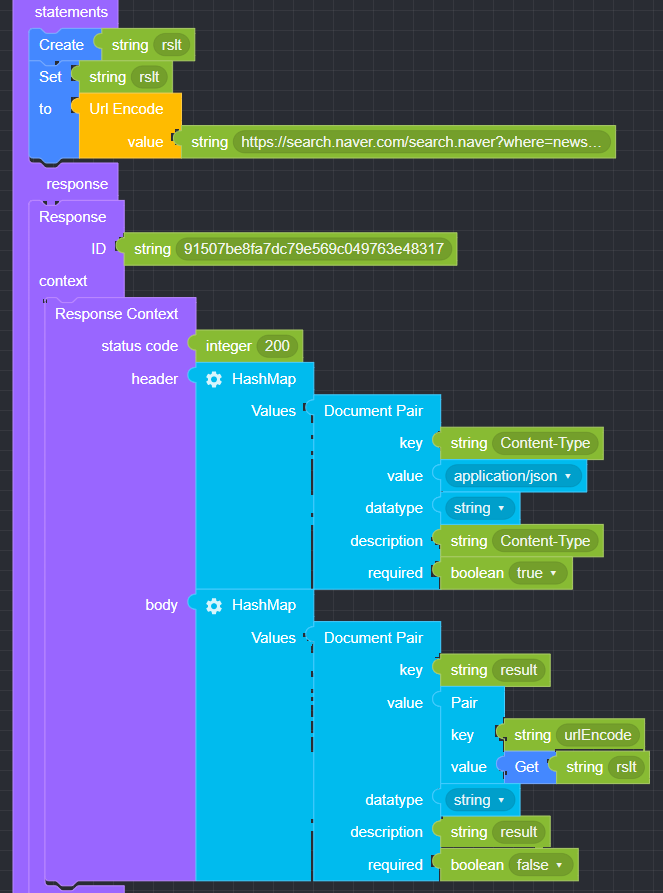
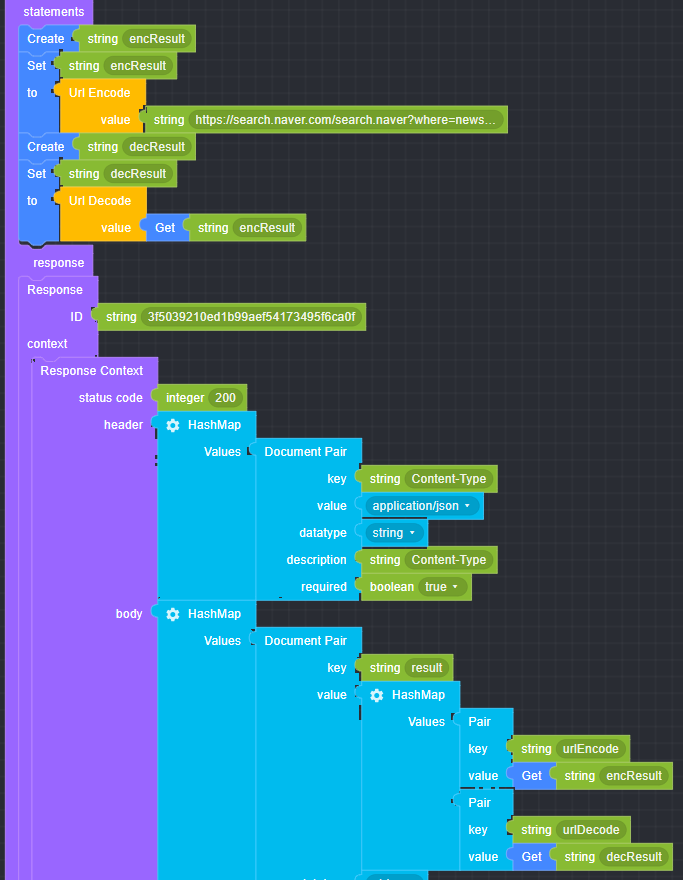

## Url

### ● Url Encode

       문자열을 인코딩하여 반환할 때 사용


#### ● 예문

<p class='comment'>Studio Copy&Paste 가능</p>
<iframe
    src="https://d1sxhpvag16wqc.cloudfront.net/v3.1.0/url/url_encode"
    width="100%"
    height="800px"
    allow=""
    sandbox="allow-scripts allow-same-origin" />
<div class="display-pdf">
    <p></p>
</div>

#### ● 결과

```text
{
  "result": {
    "urlEncode": "https%3A%2F%2Fsearch.naver.com%2Fsearch.naver%3Fwhere%3Dnews%26sm%3Dtab_jum%26query%3D%25EC%2597%2594%25ED%2584%25B0%25ED%2594%258C"
  }
}
```

### ● Url Decode

        인코딩 된 문자열을 원래 문자열로 원복할 때 사용


#### ● 예문

<p class='comment'>Studio Copy&Paste 가능</p>
<iframe
    src="https://d1sxhpvag16wqc.cloudfront.net/v3.1.0/url/url_decode"
    width="100%"
    height="800px"
    allow=""
    sandbox="allow-scripts allow-same-origin" />
<div class="display-pdf">
    <p></p>
</div>

#### ● 결과

```text
{
  "result": {
    "urlEncode": "https%3A%2F%2Fsearch.naver.com%2Fsearch.naver%3Fwhere%3Dnews%26sm%3Dtab_jum%26query%3D%25EC%2597%2594%25ED%2584%25B0%25ED%2594%258C",
    "urlDecode": "https://search.naver.com/search.naver?where=news&sm=tab_jum&query=%EC%97%94%ED%84%B0%ED%94%8C"
  }
}
```
