## SAML

### ● SAML 2.0 Request 예문

        Assertion 발급
<p class='comment'>Studio Copy&Paste 가능</p>
<iframe
    src="https://d1sxhpvag16wqc.cloudfront.net/v3.1.0/authorization/saml2.0_request"
    width="100%"
    height="800px"
    allow=""
    sandbox="allow-scripts allow-same-origin" />
<div class="display-pdf">
    <p>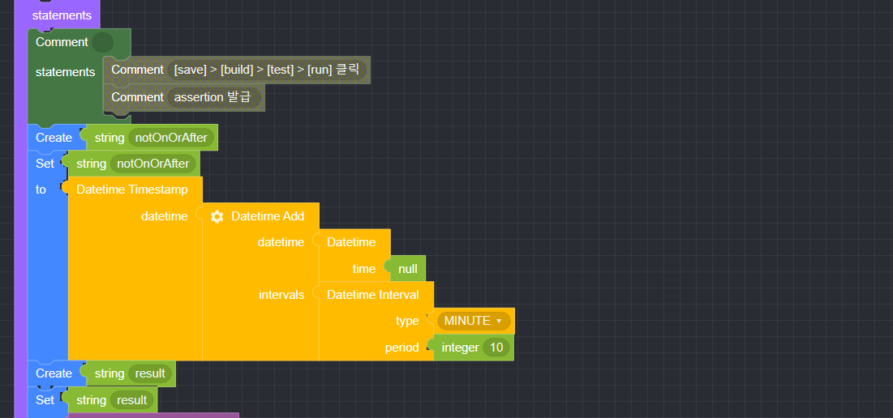</p>
    <p>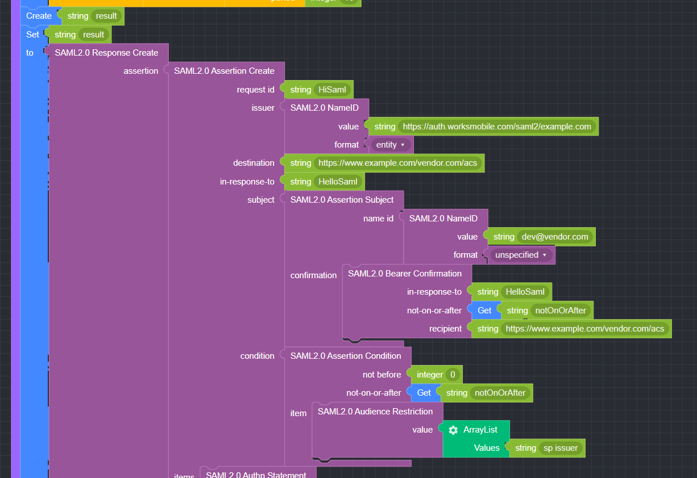</p>
    <p>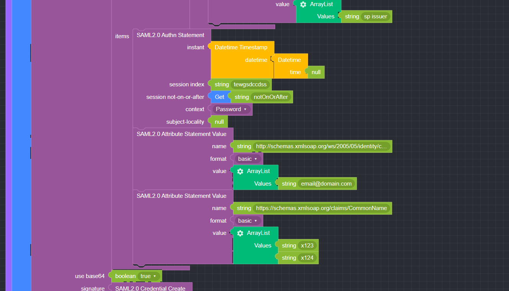</p>
    <p>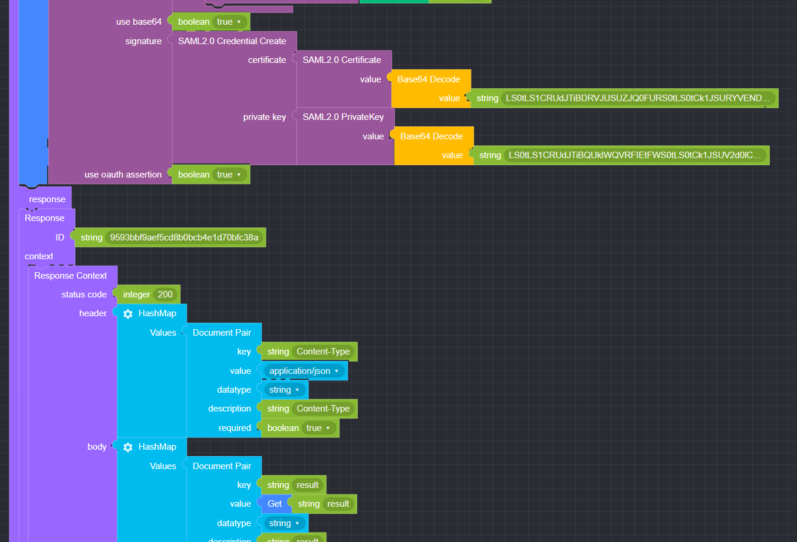</p>
</div>

### ● 결과

```text
{
  "result": "PD94bWwgdmVyc2lvbj0iMS4wIj8+CjxzYW1scDpSZXNwb25zZSB4bWxuczpzYW1scD... ... ."
}
```

### ● SAML 2.0 Token 예문

       Assertion 입력
<p class='comment'>Studio Copy&Paste 가능</p>
<iframe
    src="https://d1sxhpvag16wqc.cloudfront.net/v3.1.0/authorization/saml2.0_token"
    width="100%"
    height="800px"
    allow=""
    sandbox="allow-scripts allow-same-origin" />
<div class="display-pdf">
    <p>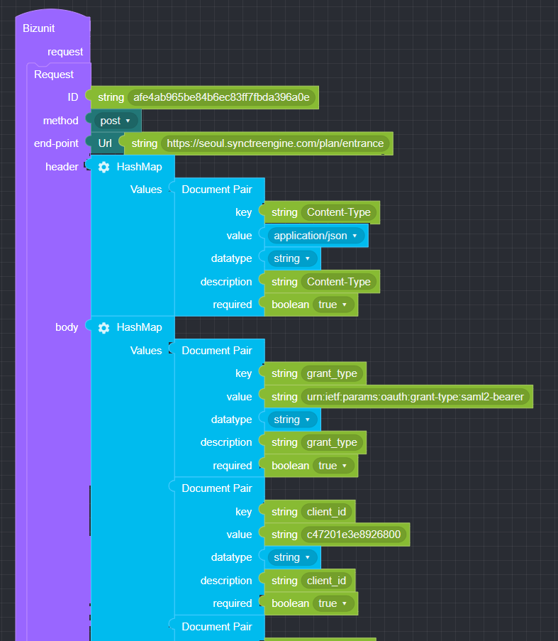</p>
    <p>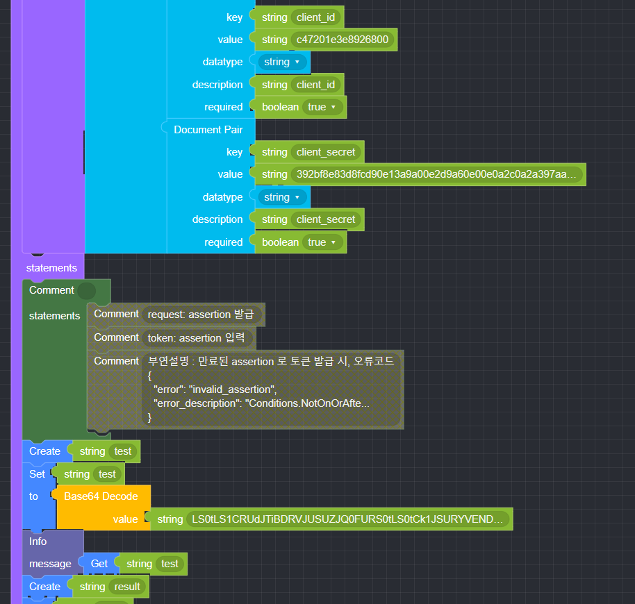</p>
    <p>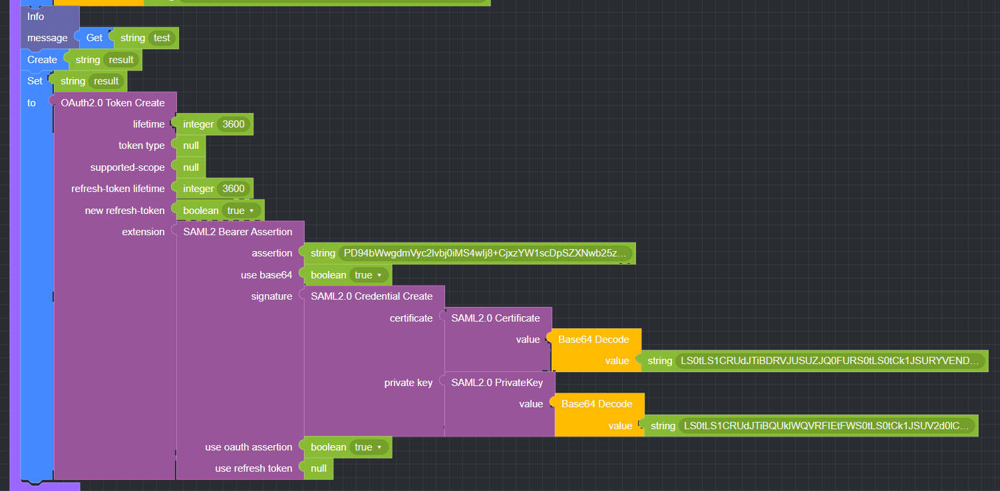</p>
    <p>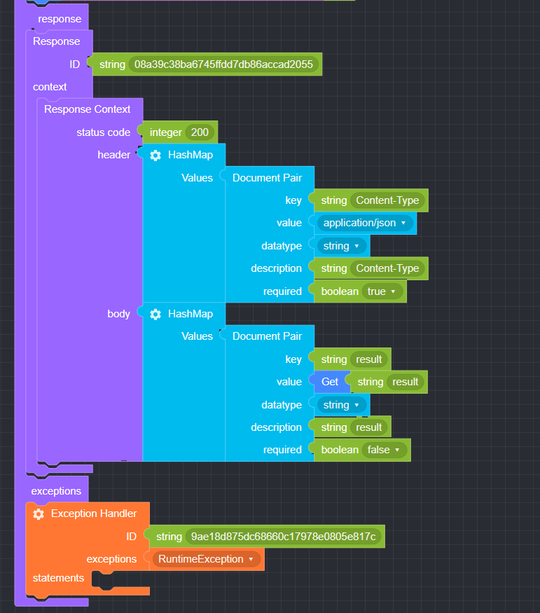</p>
</div>

### ● 결과

```text
{
  "result": {
    "access_token": "6dbfe2b0e270afb02e61a8eb43e1e3bd90c404a4",
    "expires_in": 3600,
    "token_type": "Bearer",
    "scope": "bank.list"
  }
}
```

### ● SAML 2.0 Verify 예문

       Assertion 검증
<p class='comment'>Studio Copy&Paste 가능</p>
<iframe
    src="https://d1sxhpvag16wqc.cloudfront.net/v3.1.0/authorization/saml2.0_verify"
    width="100%"
    height="800px"
    allow=""
    sandbox="allow-scripts allow-same-origin" />
<div class="display-pdf">
    <p>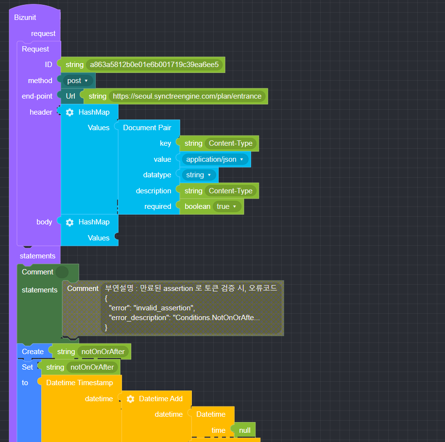</p>
    <p>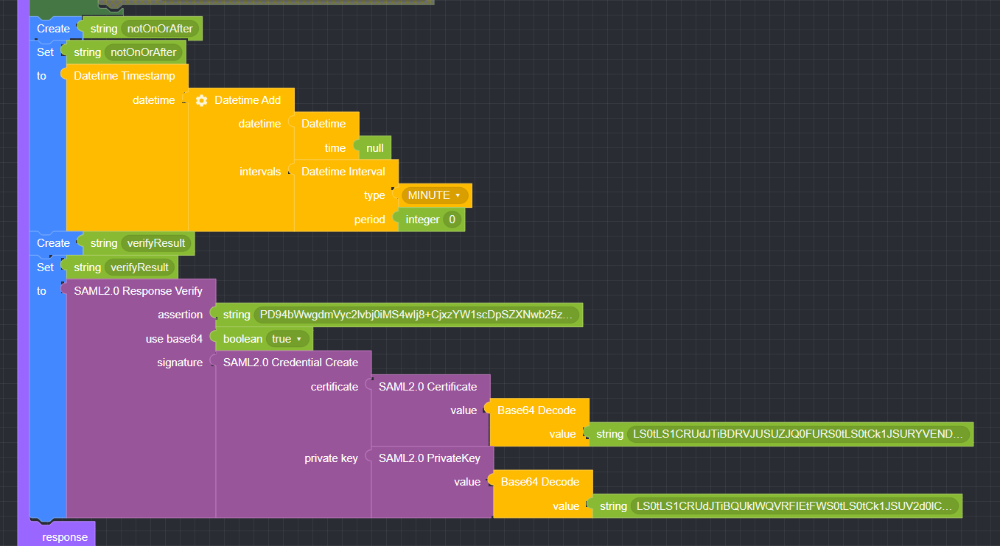</p>
    <p>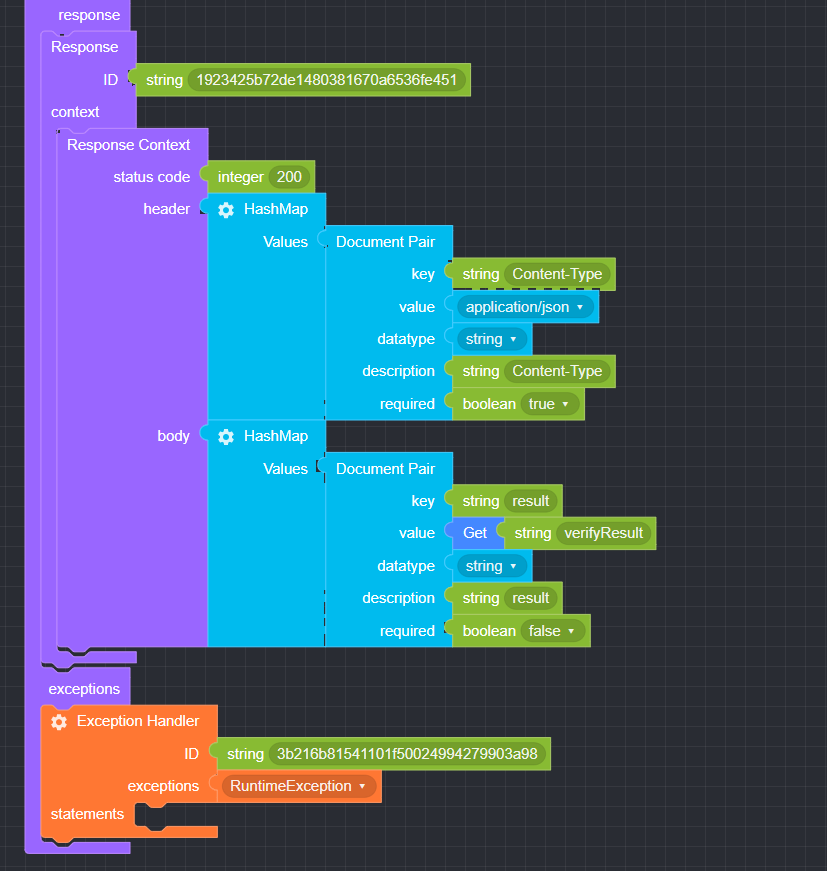</p>
</div>

### ● 결과

```text
{
  "result": {
    "access_token": "0e7627d971486ff2be7c4ba7dd98f7d29a2e515c",
    "expires_in": 3600,
    "token_type": "Bearer",
    "scope": "bank.list"
  }
}
```