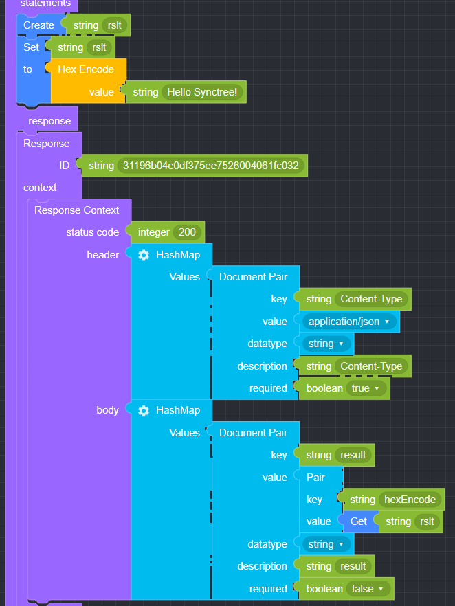

## Convert

### ● Hex Encode

       Hex 인코딩 시 사용


#### ● 예문
<p class='comment'>Studio Copy&Paste 가능</p>
<iframe
    src="https://d1sxhpvag16wqc.cloudfront.net/v3.1.0/convert/hex_encode"
    width="100%"
    height="800px"
    allow=""
    sandbox="allow-scripts allow-same-origin" />
<div class="display-pdf">
    <p></p>
</div>

#### ● 결과

```text
{
  "result": {
    "hexEncode": "48656c6c6f2053796e637472656521"
  }
}
```

### ● Hex Decode

       Hex 인코딩 된 데이터를 Decode 된 데이터로 변환할 때 사용


#### ● 예문
<p class='comment'>Studio Copy&Paste 가능</p>
<iframe
    src="https://d1sxhpvag16wqc.cloudfront.net/v3.1.0/convert/hex_decode"
    width="100%"
    height="800px"
    allow=""
    sandbox="allow-scripts allow-same-origin"/>
<div class="display-pdf">
    <p></p>
</div>

#### ● 결과

```text
{
  "result": {
    "hexEncode": "48656c6c6f2053796e637472656521",
    "hexDecode": "Hello Synctree!"
  }
}
```
