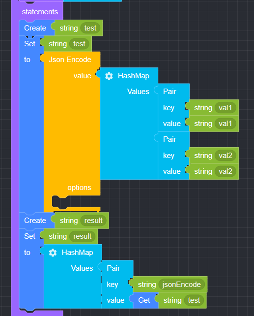

## Json

### ● Json Encode

         입력된 데이터를 JSON 형태로 변환할 때 사용


#### ● 예문
<p class='comment'>Studio Copy&Paste 가능</p>
<iframe
    src="https://d1sxhpvag16wqc.cloudfront.net/v3.1.0/json/json_encode"
    width="100%"
    height="800px"
    allow=""
    sandbox="allow-scripts allow-same-origin" />
<div class="display-pdf">
    <p></p>
</div>

#### ● 결과

```text
{
  "result": {
    "jsonEncode": "{\"val1\":\"val1\",\"val2\":\"val2\"}"
  }
}
```

### ● Json Decode

        JSON 형태의 데이터를 Decode된 데이터로 변환할 때 사용


#### ● 예문
<p class='comment'>Studio Copy&Paste 가능</p>
<iframe
    src="https://d1sxhpvag16wqc.cloudfront.net/v3.1.0/json/json_decode"
    width="100%"
    height="800px"
    allow=""
    sandbox="allow-scripts allow-same-origin" />
<div class="display-pdf">
    <p></p>
</div>

#### ● 결과

```text
{
  "result": {
    "jsonEncode": "{\"val1\":\"val1\",\"val2\":\"val2\"}",
    "jsonDecode": {
      "val1": "val1",
      "val2": "val2"
    }
  }
}
```

### ● Encode Option

        인코딩 옵션 (PHP 기반)


### ● Decode Option

        디코딩 옵션 (PHP 기반)


