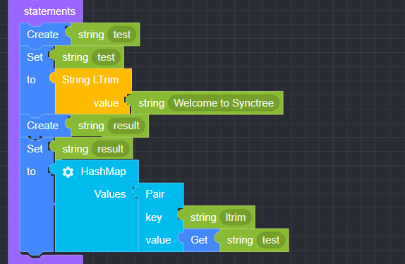

## String

### ● String Concat

        여러 개의 String 문자열을 하나로 통합할 때 사용


        설정 버튼을 클릭하여 item을 추가 또는 삭제 가능


#### ● 예문
<p class='comment'>Studio Copy&Paste 가능</p>
<iframe
    src="https://d1sxhpvag16wqc.cloudfront.net/v3.1.0/util/string_concat"
    width="100%"
    height="800px"
    allow=""
    sandbox="allow-scripts allow-same-origin" />
<div class="display-pdf">
    <p></p>
</div>

#### ● 결과

```text
{
  "result": {
    "concat": "Welcome to Synctree"
  }
}
```

### ● String Index

         문자열에서 찾고자 하는 문자의 위치를 찾을 때 사용


#### ● 예문
<p class='comment'>Studio Copy&Paste 가능</p>
<iframe
    src="https://d1sxhpvag16wqc.cloudfront.net/v3.1.0/util/string_index"
    width="100%"
    height="800px"
    allow=""
    sandbox="allow-scripts allow-same-origin"/>
<div class="display-pdf">
    <p></p>
</div>

#### ● 결과

```text
{
  "result": {
    "index": 11
  }
}
```

### ● String Format

        문자열 포맷팅


        설정 버튼을 클릭하여 item을 추가 또는 삭제 가능


### ● String Charset Encode

        문자열 인코딩


### ● String Length

        문자열의 길이를 확인할 때 사용


#### ● 예문
<p class='comment'>Studio Copy&Paste 가능</p>
<iframe
    src="https://d1sxhpvag16wqc.cloudfront.net/v3.1.0/util/string_length"
    width="100%"
    height="800px"
    allow=""
    sandbox="allow-scripts allow-same-origin"/>
<div class="display-pdf">
    <p></p>
</div>

#### ● 결과

```text
{
  "result": {
    "length": 19
  }
}
```

### ● String ToArray

        문자열을 배열로 반환 시 사용


#### ● 예문
<p class='comment'>Studio Copy&Paste 가능</p>
<iframe
    src="https://d1sxhpvag16wqc.cloudfront.net/v3.1.0/util/string_toarray"
    width="100%"
    height="800px"
    allow=""
    sandbox="allow-scripts allow-same-origin"/>
<div class="display-pdf">
    <p></p>
</div>

#### ● 결과

```text
{
  "result": {
    "string-to-array": [
      "W",
      "e",
      "l",
      "c",
      "o",
      "m",
      "e",
      " ",
      "t",
      "o",
      " ",
      "S",
      "y",
      "n",
      "c",
      "t",
      "r",
      "e",
      "e"
    ]
  }
}
```

### ● String Substring

        문자열의 일부분을 추출할 때 사용


#### ● 예문
<p class='comment'>Studio Copy&Paste 가능</p>
<iframe
    src="https://d1sxhpvag16wqc.cloudfront.net/v3.1.0/util/string_substring"
    width="100%"
    height="800px"
    allow=""
    sandbox="allow-scripts allow-same-origin"/>
<div class="display-pdf">
    <p></p>
</div>

#### ● 결과

```text
{
  "result": {
    "substring": "Welcome to Synctre"
  }
}
```

### ● String Replace

        문자열에서 특정 문자를 다른 문자로 변경할 때 사용


#### ● 예문
<p class='comment'>Studio Copy&Paste 가능</p>
<iframe
    src="https://d1sxhpvag16wqc.cloudfront.net/v3.1.0/util/string_replace"
    width="100%"
    height="800px"
    allow=""
    sandbox="allow-scripts allow-same-origin"/>
<div class="display-pdf">
    <p></p>
</div>

#### ● 결과

```text
{
  "result": {
    "before": "Welcome to Ntuple",
    "replaced": "Welcome to Synctree"
  }
}
```

### ● String Repleace-Regex

        문자열에 정규식 패턴과 일치 하는 문자를 변환할 때 사용


### ● String Split

        문자열의 특정 문자를 구분으로 문자열을 분할하여 배열로 출력할 때 사용


#### ● 예문
<p class='comment'>Studio Copy&Paste 가능</p>
<iframe
    src="https://d1sxhpvag16wqc.cloudfront.net/v3.1.0/util/string_split"
    width="100%"
    height="800px"
    allow=""
    sandbox="allow-scripts allow-same-origin"/>
<div class="display-pdf">
    <p></p>
</div>

#### ● 결과

```text
{
  "result": {
    "split": [
      "Welcome to",
      " Synctree"
    ]
  }
}
```

### ● String Split-Regex

        문자열 분할(정규표현식) 시 사용


### ● String LTrim

         문자열의 왼쪽 공백을 삭제할 때 사용


#### ● 예문
<p class='comment'>Studio Copy&Paste 가능</p>
<iframe
    src="https://d1sxhpvag16wqc.cloudfront.net/v3.1.0/util/string_ltrim"
    width="100%"
    height="800px"
    allow=""
    sandbox="allow-scripts allow-same-origin"/>
<div class="display-pdf">
    <p></p>
</div>

#### ● 결과

```text
{
  "result": {
    "ltrim": "Welcome to Synctree"
  }
}
```

### ● String RTrim

         문자열의 오쪽 공백을 삭제할 때 사용


#### ● 예문
<p class='comment'>Studio Copy&Paste 가능</p>
<iframe
    src="https://d1sxhpvag16wqc.cloudfront.net/v3.1.0/util/string_rtrim"
    width="100%"
    height="800px"
    allow=""
    sandbox="allow-scripts allow-same-origin"/>
<div class="display-pdf">
    <p></p>
</div>

#### ● 결과

```text
{
  "result": {
    "rtrim": "Welcome to Synctree"
  }
}
```
