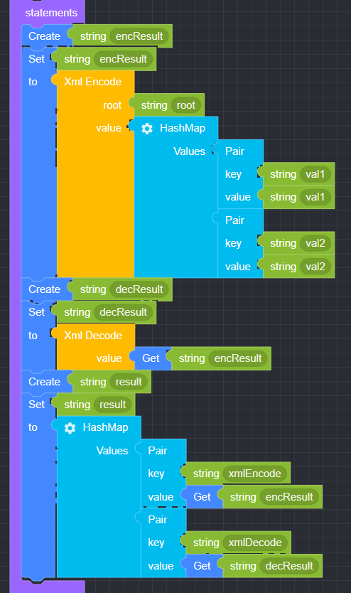

## Xml

### ● Xml Encode

        입력된 데이터를 XML 형태로 변환할 때 사용


#### ● 예문
<p class='comment'>Studio Copy&Paste 가능</p>
<iframe
    src="https://d1sxhpvag16wqc.cloudfront.net/v3.1.0/xml/xml_encode"
    width="100%"
    height="800px"
    allow=""
    sandbox="allow-scripts allow-same-origin" />
<div class="display-pdf">
    <p></p>
</div>

#### ● 결과

```text
{
  "result": {
    "xmlEncode": "<?xml version=\"1.0\" encoding=\"UTF-8\"?>\n<root><val1>val1</val1><val2>val2</val2></root>\n"
  }
}
```

### ● Xml Decode

        XML 형태의 데이터를 Decode된 데이터로 변환할 때 사용


#### ● 예문
<p class='comment'>Studio Copy&Paste 가능</p>
<iframe
    src="https://d1sxhpvag16wqc.cloudfront.net/v3.1.0/xml/xml_decode"
    width="100%"
    height="800px"
    allow=""
    sandbox="allow-scripts allow-same-origin" />
<div class="display-pdf">
    <p></p>
</div>

#### ● 결과

```text
{
  "result": {
    "xmlEncode": "<?xml version=\"1.0\" encoding=\"UTF-8\"?>\n<root><val1>val1</val1><val2>val2</val2></root>\n",
    "xmlDecode": {
      "root": {
        "val1": "val1",
        "val2": "val2"
      }
    }
  }
}
```
